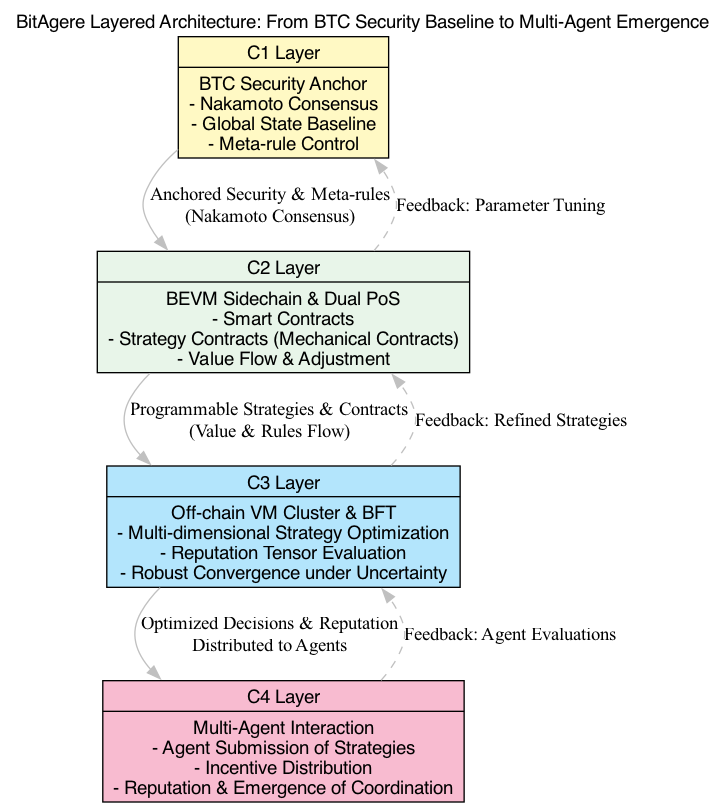
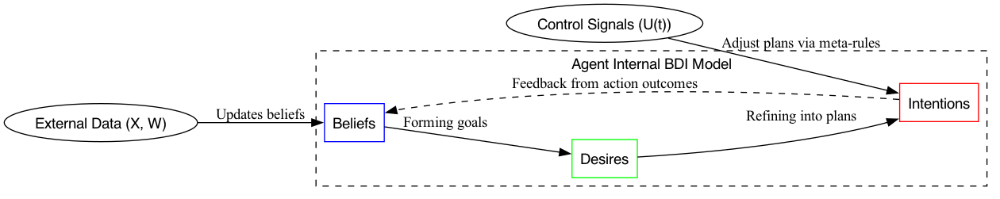
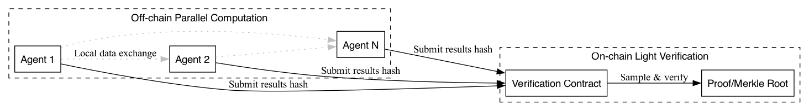

# BitAgere: A Multi-Agere Interconnected System Based on Bitcoin

## Abstract

In an era characterized by the absence of centralized authority and the coexistence of multi-agents, building trust and consensus has become a core challenge. This paper introduces the Cognito theoretical model, inspired by philosophical and mathematical reflections on Turing computability and Gödel's incompleteness theorem. Leveraging the feedback mechanism of Wiener cybernetics, the model constructs an adaptive and sustainably evolving consensus logic framework based on a "control-computation-communication" triadic closed-loop structure.

Practically, grounded on Bitcoin's security and decentralization, the BitAgere system connects multi-agents forming "Agere" through the design of "mechanical contracts," creating a scalable consensus field. This enables efficient information exchange and decision integration across the network. Through this adaptive consensus mechanism, trust transfer and collaboration among agents can occur without centralized management, building a secure, trustworthy, and efficiently coordinated Agere world. This offers a novel theoretical and practical pathway to address the growing challenges of distributed trust in the information age.

## 1. Introduction

### 1.1 Background and Problem Statement

In the information age, as data and participants proliferate, system environments become highly uncertain and dynamically evolving. Traditional centralized trust mechanisms face severe challenges in security and governance. Bitcoin, using its PoW consensus, achieves ledger consistency and trusted transactions under decentralized conditions, demonstrating the potential of a peer-to-peer electronic cash system without third-party intermediaries.

However, understanding of Bitcoin and other blockchain systems is often limited to engineering practices and game-theoretic analysis, lacking a fundamental framework from the perspectives of philosophy (logical foundation), mathematics (computability and system limitations), and cybernetics (adaptive feedback). This paper seeks to address two key questions:

1. Why is computation and communication alone insufficient for sustaining trustworthy consensus in open, dynamic, and decentralized environments?
2. How can we propose an explanatory and scalable theoretical model to guide the design and evolution of future distributed systems?

### 1.2 Research Objectives and Contributions

This paper revisits Turing computability theory, leveraging Gödel's incompleteness theorem and feedback concepts from cybernetics to establish a theoretical framework that explains the inherent logic of decentralized consensus. The main contributions include:

- Revealing the limitations of pure computational models in dynamic environments from mathematical and philosophical perspectives, highlighting the importance of meta-rule adjustments.
- Integrating control, computation, and communication into a unified theoretical structure (cybernetic triplet model), forming an adaptive closed-loop.
- Analyzing the essence of Bitcoin's consensus through this model and envisioning the construction of an advanced cross-domain consensus field, "BitAgere."

## 2. Theoretical Foundation and Logical Construction of the Cognito Model

Achieving distributed consensus in heterogeneous and decentralized dynamic environments is a fundamental challenge in the information age. Existing theories (e.g., FLP impossibility theorem and Byzantine Generals Problem) indicate that strict deterministic consistency is difficult to guarantee under asynchronous networks and potentially malicious nodes. Nevertheless, Bitcoin's PoW consensus and economic incentives effectively bypass some stringent prerequisites, achieving long-term stability and a trusted decentralized ledger. What deeper logical mechanism underpins this stability? We need to transcend pure engineering and game-theoretic analyses to construct a new theoretical framework from philosophical, mathematical, and cybernetic perspectives.

This section examines the problem from a higher-dimensional perspective. It begins by highlighting the intrinsic limitations of pure computational rules in the face of dynamic changes and unknown disturbances based on Turing computability theory and Gödel's incompleteness theorem. Then, it incorporates the feedback principles of Wiener cybernetics, integrating the triadic elements of "control-computation-communication" into a unified closed-loop structure to establish the foundational logical framework for adaptive consensus. Finally, we formally propose the cybernetic triplet (Cognito) model, rigorously defining how decentralized consensus systems adapt and evolve in response to uncertain environments through dynamic tuning at the meta-rule level.

### 2.1 From Computability and Incompleteness to the Need for Meta-Rules

**Turing Limits and the Adaptability Dilemma of Pure Computational Models**

Turing machine theory provides a formal foundation for computable functions, but it assumes that the input domain and rule set are predefined at design time. In distributed systems where node numbers, attack strategies, and network topologies continuously change, the applicability and completeness of existing rules face challenges. Pure computational models are equivalent to a static mapping *K*: *X* → *Y* (where *X* is the state space and *Y* is the output space). If environmental disturbances *w(t)* exceed the initial design domain, the system cannot generate effective decisions through existing rules, leading to an adaptability crisis.

**Gödel's Incompleteness Theorem as Inspiration**

Gödel's theorem demonstrates that complex formal systems contain undecidable problems, meaning no closed system can prove its completeness from within. Analogous to distributed consensus: when new attack patterns or strategy combinations emerge beyond the logical "axiomatic system" defined by the initial protocol, the system cannot generate responses within its internal framework. While not a strict mathematical inference, this analogy suggests that without an additional "meta-rule layer" to dynamically extend and modify the protocol, the system will struggle to address undecidable problems, leading to inadequate adaptability in the consensus mechanism.

Thus, to handle unpredictable changes (undecidable problems) in the environment, systems need to establish a meta-rule regulatory structure beyond internal rules, breaking the closure and static nature of pure computational models.

### 2.2 Introduction of Wiener Cybernetics and Feedback Loops

**The Concept of Feedback Control**

Cybernetics (Wiener, 1948) provides a foundational methodology for maintaining system output targets in uncertain environments: by comparing the current output with the desired target, errors are fed back to the control layer to dynamically adjust system parameters and strategies. This feedback loop allows systems to maintain stability or evolve continuously under disturbances.

**Triadic Closed-Loop Structure**

Drawing from cybernetics, we abstract distributed consensus systems into a closed-loop structure composed of control (Control, *C*), computation (Computation, *K*), and communication (Communication, *M*). The following functional mappings are defined:

- *C*: *X* × *W* → *U*: The control layer extracts information from state *x(t)* and environmental disturbances *w(t)*, outputting meta-rule directives *u(t)*. This serves as the system's strategic layer, dynamically tuning consensus protocol parameters (e.g., difficulty targets, economic incentive mechanisms).
- *K*: *X* × *U* → *Y*: The computation layer executes specific validation and accounting operations (e.g., transaction verification and block construction) under control directives *u(t)*, producing output *y(t)*.
- *M*: *X* × *Y* → *X*: The communication layer disseminates and integrates computation results *y(t)* across the network, enabling all nodes to achieve consistent state updates *x(t+1)*.

Through iterative *C*-*K*-*M* loops, the system state evolves over time:

$$
x(t) → u(t) → y(t) → x(t+1)
$$

When external disturbances *w(t)* change, the control layer *C* can dynamically adjust *u(t)*, influencing computation and communication processes, enabling the system to adapt responsively to new problems within the feedback loop.

### 2.3 Establishment of the Cybernetic Triplet Model (Cognito Theory)

Building on the above analysis, we arrive at a conceptual breakthrough: introducing a control layer (meta-rule layer) and communication integration above the pure computational model to construct a consensus framework with adaptive evolutionary capabilities. This idea can be formalized mathematically and logically as the Cybernetic Triplet Model (Cognito Theory).

**Definition**

A distributed consensus system *S* is represented as a triplet (*C*, *K*, *M*), satisfying:

1. *C*: *X* × *W* → *U* provides meta-rule regulation capabilities to dynamically respond to environmental disturbances.
2. *K*: *X* × *U* → *Y* executes consensus logic and computation operations under given strategies.
3. *M*: *X* × *Y* → *X* ensures effective information transmission and integration across the network, achieving state updates.

This model enables analysis of system stability, adaptability, and scalability under uncertain conditions. Further leveraging stability determination methods in cybernetics (e.g., Lyapunov analysis, *H*∞ control, or robust control theory) could rigorously prove conditions under which the system achieves stability or continuous evolution under certain disturbance sets.

### 2.4 Theoretical Significance and Future Research Directions

Cognito Theory transcends the engineering understanding of singular cases like Bitcoin, constructing a unified theoretical paradigm for decentralized systems with multi-agents. Philosophically, it echoes Gödel's theorem on the limitations of formal systems' internal derivation. Mathematically and technically, by integrating control, computation, and communication into a unified closed-loop structure, it offers a systematic approach to handling unpredictable changes. Practically, it provides new insights for designing multi-chain consensus ecosystems, cross-domain interoperability, and autonomous organizations.

Subsequent sections will validate the explanatory power and applicability of Cognito Theory through empirical studies (e.g., Bitcoin system analysis and extensions) and further explore how this model can guide mechanism design and protocol evolution in more complex consensus scenarios, providing systematic solutions to distributed trust challenges.

## 3. The Triadic Decomposition of Bitcoin Consensus

Building on the previously established cybernetic triad model (C, K, M) and the adaptive consensus framework, this section uses Bitcoin as a classic case study to systematically explain how its consensus mechanism extends from the chain-level to asset-level and user-level propagation. Through an analysis of the UTXO model and SPV light client scheme, we demonstrate how consensus transmits value and trustworthiness across multi-layered structures. Furthermore, we extend this multidimensional framework to a higher-level "Consensus Field" concept, enabling distributed trust to flow continuously among multiple entities and systems, ultimately forming a global consensus ecosystem beyond individual chains and enabling cross-domain collaboration (BitAgere).

### 3.1 Bitcoin Consensus Explained via the C-K-M Loop

Bitcoin’s PoW consensus mechanism serves as an exemplary practical application of the C-K-M triad model:

- **Control Layer (C)**: Dynamically adjusts mining difficulty and halving rewards to counter external disturbances (e.g., changes in hash rate, participant strategies), ensuring the system's long-term stability and security. This control signal $u(t)$ continuously reflects the state of the system and its goals, granting the consensus protocol adaptive capabilities.
- **Computation Layer (K)**: Miners execute hash calculations to verify candidate blocks, and nodes perform logical validation and script checks for transactions and blocks. This process translates abstract control strategies into verifiable outputs $y(t)$, ensuring the correctness of ledger updates.
- **Communication Layer (M)**: The P2P network propagates new blocks and transaction validation results across the network, enabling nodes to update the global state $x(t+1)$. Under decentralized conditions, this information dissemination ensures synchronized chain states across the network.

In Bitcoin, the C-K-M loop ensures ordered evolution amidst external disturbances: the control layer adjusts dynamically, the computation layer executes rigorously, and the communication layer achieves decentralized consensus. The result is an “adaptive mechanical consensus,” where consensus is both mechanically rigid and capable of iterative adaptation to environmental changes.

### 3.2 UTXO and Consensus Monetization: From Chain-Level to Value Units

Bitcoin's innovation extends beyond maintaining global ledger consistency—it embeds consensus as economically meaningful value units through the UTXO model:

- Once network nodes reach consensus on a block containing a specific transaction, the transaction-derived UTXO gains globally recognized economic properties.
- Consensus transitions from abstract ledger records to “consensus assets” that users can freely transfer, retain, and verify.
- The control and computation layers ensure UTXO legality and scarcity, while the communication layer ensures seamless synchronization of these asset states across the network. The UTXO model consolidates consensus into transmittable value, endowing consensus outcomes with economic incentives and allocation efficacy.

Thus, consensus achieves "monetization": chain-level rules evolve into universally credible digital value units, laying the foundation for economic activities and trust transfer.

### 3.3 SPV Mechanism and Consensus Propagation: From Full Nodes to Lightweight Clients

The SPV (Simplified Payment Verification) mechanism allows lightweight clients to verify specific transactions’ validity and consensus security without storing the complete chain data. This process represents consensus scaling and propagation at the user level:

- **Control Layer (C)**: Difficulty adjustment (PoW) retains hard verification marks in block headers, providing a global security metric foundation for SPV.
- **Computation Layer (K)**: All validations and execution results performed by full nodes are solidified in the blockchain. SPV clients do not repeat these computations but only fetch the relevant block headers and Merkle proofs for the target transaction.
- **Communication Layer (M)**: Transmits the block header chain and corresponding Merkle paths to SPV clients, enabling them to inherit the network-wide consensus security with minimal data costs.

SPV exemplifies layered consensus propagation and efficiency enhancement: full nodes establish the global consensus foundation, while lightweight nodes gain security and trustworthiness with minimal data overhead, enabling low-trust-cost user access. This propagation naturally extends consensus to the user end, enhancing inclusiveness and practical usability.

### 3.4 Cross-Domain Consensus Expansion and BitAgere Concept: From Multi-Chain Interoperability to a Consensus Field

The current consensus ecosystem remains discrete and fragmented: different chains, application scenarios, and consensus mechanisms often coexist in isolated states, lacking sustained and natural trust propagation mechanisms. BitAgere aims to transform this discreteness into a continuous "Consensus Field":

- **From Points to Fields**: Single-chain consensus is treated as a point, while a consensus field maps the consensus of multiple chains, systems, and entities into a continuous topological structure.
- **C-K-M Extensions**: In a consensus field, the control layer moves beyond single-parameter adjustments to meta-level governance for multi-dimensional entities (human societies, other blockchains, AI agents). The computation layer integrates multi-source verification logic (cross-chain message authentication, zero-knowledge proofs, AI decision mapping). The communication layer expands into cross-domain routing and inter-system relay protocols, allowing information and trust to flow continuously across the global network.
- **Further Evolution of Consensus Monetization**: In a consensus field, assets extend beyond UTXO-style single-chain value units to include cross-chain credit certificates, social governance tokens, AI model parameter incentives, and other multi-level value abstractions. Consensus assets become the carriers of trust within the field, enabling multi-dimensional, continuous interaction between humans, machines, contracts, and agents.

Through the consensus field concept, BitAgere transcends multi-chain interoperability as a mere technical implementation. It represents an elevation in logic and philosophy: consensus transitions from isolated aggregations to a continuous structure that provides global trust propagation. This reduces friction, improves resource allocation efficiency, and creates conditions for multi-entity global collaboration.

### 3.5 Summary

This section deconstructed Bitcoin's C-K-M loop to analyze its adaptive consensus and multi-layered propagation properties. Through the UTXO model, consensus was solidified into economically valuable assets; leveraging the SPV mechanism, consensus was simplified and extended to lightweight client users. Logical extrapolation led to the conceptualization of BitAgere and the consensus field theory, aiming to achieve seamless and efficient trust propagation in multi-chain and multi-entity environments.

This represents a shift from decentralized consensus within isolated systems to a global, continuous multi-dimensional trust structure. The C-K-M model lays the theoretical foundation for this grand vision, while the consensus field provides a unified perspective, integrating various consensus mechanisms, monetization processes, and adaptive control strategies into a logically sustainable evolutionary framework.

## 4. BitAgere Multi-Agent Consensus System

Building on the secure foundation of Satoshi Nakamoto's PoW consensus and insights from the Cognito theory, BitAgere aims to unify the strategy-making, value transmission, and reputation evolution of multi-agents (Agents) within a decentralized Consensus Field. By integrating the triadic structure of Control (C), Computation (K), and Communication (M) with the paradigms of “mechanical consensus” and “mechanical contracts” (Agere framework), BitAgere elevates multi-agent collaboration from discrete decision-making to a sustainable evolutionary "mechanical world" framework, achieving consensus monetization, computationalization, and multi-chain expansion.

### 4.1 Layered Architecture and Agent Connectivity

BitAgere adopts a layered structure, using the BTC main chain as a globally recognized security anchor while building sidechains (BEVM) and off-chain virtual machine clusters to provide a programmable environment and high-dimensional computational capabilities for multi-agent interactions and optimizations. The input/output (I/O) mappings, strategy transformations, and state anchoring between layers form a closed-loop system:

- **C1 Layer (BTC Security Anchoring Layer)**:
Anchors global state commitments through Satoshi Nakamoto consensus, providing a credible benchmark. Mechanical consensus and Cognito meta-rule adjustments (Control) together ensure a solid foundation for agent interactions at higher layers.
- **C2 Layer (BEVM Programmable Execution and Dual-PoS Model Layer)**:
Extends BTC consensus security to enable smart contract execution and strategy parameter updates via the BEVM sidechain. Utilizing a dual-PoS probabilistic model, this layer achieves consensus extension, value flow, and flexible deployment of strategy contracts (mechanical contracts).
- **C3 Layer (Off-Chain VM Cluster and BFT Optimization Layer)**:
Multi-dimensional agent strategies (e.g., BDI cognitive models, AOP paradigms) are asynchronously optimized and reputation tensors evaluated through off-chain virtual machine clusters. BFT consensus ensures robust solutions even in heterogeneous, multi-modal data, and uncertain environments. This layer empowers nodes with the ability to continuously evolve strategies, reputation, and rewards.
- **C4 Layer (Multi-Agent Interaction Layer)**:
At this outermost layer, numerous agents (e.g., Agent0 with foundational cognitive frameworks) interact dynamically through strategy submissions, reward claims, and mutual evaluations, adapting to environmental changes. This enables a dynamic process where consensus evolves from individual decision-making to full-network collaboration, transcending single-chain ledger consistency to establish a distributed trust, collaboration, and evolution mechanism within a Consensus Field.

### 4.2 Agent Model and Internal BDI Cognitive Framework

Each agent embodies distinct "agenthood," mapping the Cognito triadic loop logic to its internal mechanisms through an embedded BDI (Belief-Desire-Intention) model and AOP principles:

- **Belief**:
Anchored states and reputation distributions from C1, C2, and C3 layers form the basis of the agent’s beliefs, enabling it to assess the global state, BTC consensus security, computational contributions, and the quality of others’ outputs.
- **Desire**:
Driven by goals such as inflation rewards, bond returns, computationalization metrics, and specific application domain needs (e.g., text processing or image recognition).
- **Intention**:
Under the influence of meta-rule adjustments at the control layer, off-chain decision packages (C3 layer), and sidechain contract mechanisms (C2 layer), agents map their computational resources, validation capabilities, and incentive allocations (stake and bonds) into specific adaptive and evolving strategies.

This process exemplifies "Agentification," where nodes evolve from passive participants in consensus to intelligent entities actively planning strategies, evaluating others’ actions, and investing in trust relationships within a mechanical world.

### 4.3 Emergence and Adaptation: A Mechanical World of Multi-Agent Collaboration

Through interactions across multi-layer structures and multi-modal data, the system exhibits emergent properties. Agents self-organize based on mechanical contracts (formalized constraints in contract code), consensus monetization (e.g., UTXOs or cross-chain value units), computationalization (mapping intelligent computational contributions into economic value), and reputation propagation (Agere-based reputation transmission). The micro-level adjustments by individual agents aggregate into a macro-level multi-agent consensus field, akin to an adaptive ecosystem in a mechanical world.

In this consensus field, agents not only solve the Nakamoto problem (maintaining long-term stability without centralization) but also respond robustly to unpredictable disturbances through strategy evolution and BFT consensus in heterogeneous environments. Key dynamics include:

- High-reputation agents receive more stake support, enhancing their influence in subsequent strategy optimization.
- Heterogeneous agents excel in different domain-specific tasks, extending consensus from basic ledger validation to advanced intelligent applications.
- Adapting to environmental changes and updated performance metrics, agents continuously refine their strategies using distributed reinforcement learning, evolutionary algorithms, or other intelligent optimization techniques, guiding the network toward a dynamic trajectory of multi-objective Nash equilibrium.

BitAgere’s design inherits Bitcoin's core traits of decentralization and trustless ledger consensus while emphasizing sustained adaptation and evolution in multi-entity, multi-layered, and multi-domain settings.

## 5. Practical Challenges and Improvement Path: From On-Chain Bottlenecks to Distributed Intelligence Evolution

In the BitAgere multi-agent consensus system, a large number of agents need to solve complex, high-dimensional data problems (such as reputation matrices and strategy tensors) and perform probabilistic convergence calculations to achieve dynamic adaptation and strategy optimization. However, directly centralizing such intensive computations on-chain not only faces bottlenecks in security and scalability but also encounters paradoxes in accurately modeling and approximating real-world scenarios. To overcome these challenges, this section identifies the root causes of the issues and proposes an actionable technical framework based on distributed computational expansion and lightweight on-chain validation to support the ongoing evolution of the multi-agent consensus ecosystem.

### 5.1 On-Chain Bottlenecks and Multi-Agent Optimization Challenges

Traditional blockchain architectures enforce tight control over on-chain resources (computation, storage, bandwidth) to ensure system security and decentralization. This makes solving high-dimensional matrices, complex game optimization, or probabilistic convergence on-chain exceedingly difficult:

- **Resource Constraints**:
The on-chain execution environment imposes strict limits on computation and memory. Attempts to approximate the complex strategy spaces of real-world ecosystems under these constraints would severely degrade throughput efficiency and user experience.
- **Insufficient Sampling and Approximation**:
The number of on-chain nodes and their computational capacity is limited, making it difficult to provide sufficient samples or multi-source data for multi-agent strategy evaluation. Relying solely on limited on-chain node computation and scoring can lead to significant inaccuracies.
- **The Paradox of Exactness and Realism**:
Seeking global optima on-chain requires simplifying models or narrowing participation, inevitably deviating from the complexities of real-world multi-agent interactions. Retaining high complexity, however, overwhelms on-chain computation, leading to a no-win situation.

These constraints highlight that relying solely on centralized on-chain computation is insufficient to meet the high-dimensional and high-flexibility demands of BitAgere’s multi-agent intelligence evolution.

### 5.2 Proposed Solution: Distributed Computation and Lightweight On-Chain Validation

Drawing inspiration from successful distributed systems like Bitcoin, we can delegate computationally intensive tasks to off-chain agents for parallel processing, leveraging massive parallelism for nearly infinite computational scalability. On-chain mechanisms would then focus on lightweight validation and meta-rule adjustments, ensuring the credibility and convergence of final states in a decentralized environment.

1. **Off-Chain Distributed Computation**:
High-intensity tasks such as large-scale strategy optimization, reputation matrix solving, and probabilistic iteration calculations are independently executed by numerous agents off-chain. Each agent processes data and solves models in parallel locally, allowing the system to flexibly harness external computational resources without adding an on-chain burden.
2. **Lightweight On-Chain Validation and Statistical Sampling**:
Smart contracts on-chain do not directly engage in global computation. Instead, they audit agent-submitted results using lightweight methods such as random sampling, hash verification, Merkle proofs, and statistical filtering. If discrepancies or anomalies are detected, the control layer (C-layer) dynamically adjusts validation frequency and incentive parameters, forming an adaptive feedback loop.
3. **Macro Emergence Over Micro Exactness**:
The on-chain role resembles that of an observer or arbiter, neither needing nor capable of ensuring exactness in every detail. Through extensive off-chain agent gameplay and exploration, the system gradually approximates the complexities of real-world ecosystems. The on-chain mechanism uses lightweight evidence and basic constraints to maintain consensus credibility and guide the overall direction of evolution.

### 5.3 Adaptive Architecture Based on the Cognito Triadic Model

Mapping the proposed approach back to the Cognito theory's triadic C-K-M structure and the BDI cognitive framework of agents can further enhance adaptive capabilities:

- **Control Layer (C)**:
Configures on-chain validation and sampling strategies, dynamically adjusts incentive distributions and parameter thresholds. When environmental changes or data deviations occur, the control layer fine-tunes meta-rules to steer the system back toward stability.
- **Computation Layer (K)**:
Off-chain agents execute intensive computations and strategy optimizations. Each agent iteratively solves and approaches optimal strategies using its beliefs and desires and submits result hashes or proofs on-chain.
- **Communication Layer (M)**:
Facilitates the propagation and integration of agent results and on-chain feedback across a decentralized network, ensuring seamless information transmission and state sharing across the system.

This architecture enables macro-level emergent behavior: large-scale distributed parallel computation (off-chain) and lightweight validation (on-chain) together shape a multi-agent consensus ecosystem that adapts to heterogeneous environments and supports multi-scenario extensions.

### 5.4 Future Outlook and Continuous Evolution

With the collaborative approach of distributed computation and lightweight on-chain validation, BitAgere could realize the envisioned distributed intelligence evolution. As the number and diversity of agents increase, the system's computational capacity and strategy space will expand exponentially. The on-chain mechanism, serving as the meta-rule regulator and trust anchor, needs only to conduct lightweight audits and sampling controls to maintain global consensus credibility and directional stability, achieving higher robustness and adaptability against external uncertainties.

This evolutionary trajectory paves the way for a novel paradigm of decentralized multi-agent collaboration: leveraging distributed computational intelligence and lightweight on-chain validation to absorb new tasks, data sources, and optimization methods. This approach allows the consensus field to continuously evolve within real-world complex ecosystems, laying a foundation for future cross-chain, multi-domain, multi-agent cooperative governance.

## 6. Conclusion

Inspired by Bitcoin's decentralized consensus mechanism, this paper introduces the **Cognito theory model**, incorporating insights from Turing computability theory, Gödel's incompleteness theorem, and Wiener’s cybernetic feedback principles. By integrating the triadic structure of **Control (C)**, **Computation (K)**, and **Communication (M)** into distributed consensus design, we have analyzed Bitcoin's consensus mechanism and its adaptive logic. Furthermore, we conceptualized the **BitAgere system**, a multi-agent evolutionary framework that provides theoretical and practical pathways for future cross-chain, multi-agent collaboration and intelligent scenario expansion.

Through a layered design that delegates multi-agent strategy computations to off-chain processing, complemented by lightweight on-chain validation and sampling control, this paper proposes a pathway from pure computation and game-theoretic models toward an adaptive, scalable distributed intelligence evolution. As a result, decentralized systems are no longer constrained by fixed rules and closed logic but can continuously evolve, adapt, and optimize in dynamic environments.

Looking ahead, as multi-agents evolve within a decentralized consensus field through distributed intelligence collaboration, this model holds promise for a wide range of applications, including cross-chain interoperability, autonomous organization management, and intelligent economic cooperation. The Cognito theory and the BitAgere architecture provide a new paradigm to address the rapidly growing demand for distributed trust in the information era, laying a solid philosophical, mathematical, and engineering foundation for global, cross-domain, multi-agent collaborative governance.

## 7. References

1. Turing, A. M. (1936). "On Computable Numbers, with an Application to the Entscheidungsproblem." *Proceedings of the London Mathematical Society*, 2(42):230–265.
2. Gödel, K. (1931). "Über formal unentscheidbare Sätze der Principia Mathematica und verwandter Systeme I." *Monatshefte für Mathematik und Physik*, 38:173–198.
3. Wiener, N. (1948). *Cybernetics: Or Control and Communication in the Animal and the Machine.* MIT Press.
4. Fischer, M. J., Lynch, N. A., & Paterson, M. S. (1985). "Impossibility of distributed consensus with one faulty process." *Journal of the ACM (JACM)*, 32(2):374–382.
5. Lamport, L., Shostak, R., & Pease, M. (1982). "The Byzantine generals problem." *ACM Transactions on Programming Languages and Systems (TOPLAS)*, 4(3):382–401.
6. Nakamoto, S. (2008). "Bitcoin: A Peer-to-Peer Electronic Cash System." https://bitcoin.org/bitcoin.pdf
7. Shoham, Y. (1993). "Agent-oriented programming." *Artificial Intelligence*, 60(1):51–92.
8. Rao, A. S. & Georgeff, M. P. (1995). "BDI agents: from theory to practice." In *Proceedings of the First International Conference on Multi-Agent Systems (ICMAS-95)*, pp. 312–319.
9. Wooldridge, M. (2002). *An Introduction to MultiAgent Systems.* Wiley.
10. Weiss, G. (Ed.). (1999). *Multiagent Systems: A Modern Approach to Distributed Artificial Intelligence.* MIT Press.
11. Stone, P. & Veloso, M. (2000). "Multiagent systems: A survey from A machine learning perspective." *Autonomous Robots*, 8(3):345–383.
12. Wooldridge, M., Jennings, N. R., & Kinny, D. (2000). "The Gaia Methodology for Agent-Oriented Analysis and Design." *Autonomous Agents and Multi-Agent Systems*, 3(3):285–312.
13. Belchior, R., Vasconcelos, A., Correia, M., & Vieira, M. (2021). "A Survey on Blockchain Interoperability: Past, Present, and Future Trends." *ACM Computing Surveys (CSUR)*, 54(8):1–41.