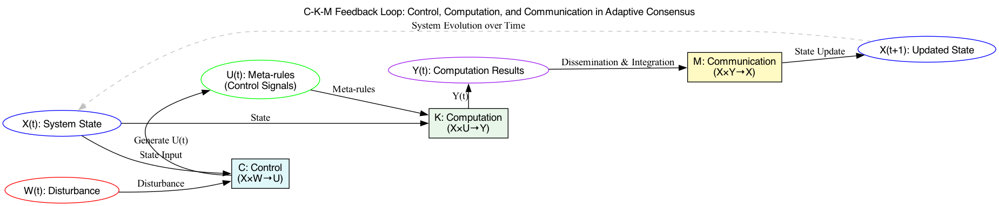
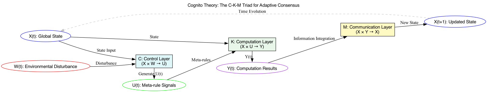
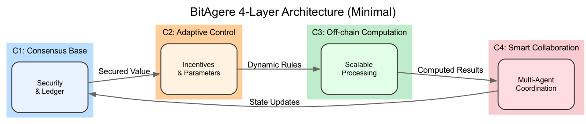

# BitAgere：一个以比特币为底层的多元Agere 互联网络

## 摘要

在多个无中心权威的机械共识环境中，如何构建可信的共识场是当前面临的核心挑战。本论文借鉴控制论的反馈闭环思想，提出了“控制—计算—通信”（C-K-M）的三元闭环共识模型（Cognito理论），并在此基础上构建了具有自适应特性的多共识融合系统BitAgere。该系统以Bitcoin的安全性与去中心化为基础，采用机械契约连接多个Agent构建Agere系统，并通过 Agere 共识机制 形成可扩展的共识场，从而实现多类型Agent系统之间的交互和跨域。Agere 共识机制能够在无中心管理的条件下，促进多 Agent 之间的信任与协同，为无中心环境下的多 Agent 协作提供了一种可扩展的安全系统方案。

**关键词**： 机械共识， 共识场， Cognito 理论，Agere系统， 机械契约， Agere共识，跨域

## 1. 引言

Bitcoin 的中本聪共识实现了无中心环境下的账本一致性与可信交易，为点对点电子现金系统提供了实证案例， 但其局限在Coin这个单一维度。区块链为了解决这一问题引入了图灵完备的VM，却陷入只重视VM层的计算，没有对外界事物共识层感知的陷阱。

本文旨在解决: **如何设计一种能够感知外部环境的自适应共识机制，并将一系列独立的机械共识系统融合成一个统一的 Agent 共识场，最终实现 Crypto 和 Agent 的融合**。

## 2. Cognito 理论模型

### 2.1 从可计算性与不完备性到元规则需求

图灵可计算理论说明可计算性有界于预设规则的范围，环境若超出初始设计域，系统就难以及时响应。哥德尔不完备性定理则暗示任一封闭系统在自身框架内存在不可自证的“盲点”。类比至共识机制，当新型攻击与策略组合出现，纯计算逻辑无法自我扩展、完善。要突破这一内在限制，需要一层元规则（Meta-Rule）对共识协议进行动态校正与适应，借以应对不可预期的变化。

### 2.2 维纳控制论与反馈闭环的引入

**反馈控制的理念**：

控制论（Wiener, 1948）为在不确定环境中维持系统目标输出提供了基础方法论：通过比较系统当前输出与期望目标，将误差反馈至控制层，进而动态调整系统参数与策略。此反馈回路使系统在扰动下仍可保持稳态或持续演化。

**三元闭环构架**：



参考控制论思想，我们将分布式共识系统抽象为由控制（Control, *C*）、计算（Computation, *K*）与通信（Communication, *M*）三部分构成的闭环结构。定义如下函数映射：

- *C* : *X* × *W* → *U*：控制层从状态 *x*(*t*) 和环境扰动 *w*(*t*)中提取信息，输出元规则指令 *u*(*t*)。这相当于系统的战略层，对共识协议参数（如难度目标、经济激励机制）进行动态调优。
- *K* : *X* × *U* → *Y*：计算层在控制指令 *u*(*t*) 下对状态 *x*(*t*)执行具体验证与记账操作（如交易校验与区块构造），输出结果 *y*(*t*)。
- *M* : *X* × *Y* → *X*：通信层将计算结果 *y*(*t*) 在网络中扩散与整合，使全网节点对下一状态 *x*(*t*+1) 达成一致更新。

通过*C* − *K* − *M*循环迭代，系统状态随时间演化：

$$
x(t) → u(t) → y(t) → x(t+1)
$$

当外部扰动 *w*(*t*) 改变，控制层 *C*可实时调整 *u*(*t*)，进而影响计算与通信过程，使系统在反馈闭环下对新问题做出自适应响应。

### 2.3 控制论三元组模型（Cognito理论）的确立

综合以上分析，我们得出认知上的跃迁：需在纯计算模型之上引入控制层（元规则层）与通信整合，构建具备自适应进化能力的共识框架。这一思想可在数学与逻辑层面形式化为控制论三元组模型（Cognito理论）：


**定义**：

分布式共识系统 *S* 表示为三元组 (*C*,*K*,*M*)，满足：

1. *C* : *X* × *W* → *U* 提供元规则调控能力，对环境扰动进行动态响应。
2. *K* : *X* × *U* → *Y* 在给定策略下执行共识逻辑与计算操作。
3. *M* : *X* × *Y* → *X* 保证信息在全网有效传递与整合，实现状态更新。
   


    
通过此模型，我们可分析在不确定条件下系统的稳定性、适应性与扩展性。若进一步借助控制论中的稳定性判定方法（如Lyapunov分析、*H*∞控制或鲁棒控制理论），有望在数学上严格论证系统在一定扰动集下实现稳态或持续演化的条件。

## 3.  Cognito 理论与统一 Agent 市场

本章通过对 Bitcoin 和 Ethereum 的对比，指出 Bitcoin 能利用中本聪共识连接外部算力，而 Ethereum 虽在计算层提升了计算能力却缺乏对现实环境的感知能力。进一步 得出结论：在分布式环境下的多方协作中，“共识比计算更重要”。通过 Cognito理论来观察Crypto 和 AI 有 Agent 这一通用基本单元，从而引入 Agent 这一通用抽象来统一描述Crypto和AI。为了用 Agent 来融合 Crypto 和AI，从而提出了 BitAgere 及“共识场”概念，将多链、多系统、多 Agent 融合为可跨域互操作的统一生态。

### 3.1 Bitcoin：共识层对外部世界的感知

从 “控制—计算—通信” (C-K-M) 的 Cognito 理论视角看，Bitcoin 的突出意义在于通过共识层直接对接外部算力，实现了与现实世界的紧密耦合。其核心结构包括：

- **控制（Control）层**
    - **难度重调（Difficulty Retargeting）**：每隔 2016 个区块，根据全网出块速率自动上调或下调挖矿难度，形成对环境（算力）的动态闭环反馈。
    - **区块奖励减半（Halving）**：按预定区块高度对区块补贴进行离散式“收敛”，平衡通胀与激励。
- **计算（Computation）层**
    - **SHA-256 PoW 算法**：矿工在哈希竞赛中胜出才拥有记账权。
    - **脚本验证机制**：节点对区块内每笔交易执行脚本验证（如 OP_CHECKSIG），共同维持 UTXO 集的一致性，保证交易的有效性。
- **通信（Communication）层**
    - **P2P Gossip 网络**：节点间通过去中心化传播区块与交易，辅以区块头中的 Merkle Root 等结构保障账本完整性。
    - **数据同步机制**：新节点可以通过区块头验证和数据同步快速加入网络，保证网络的可扩展性。

Bitcoin 通过 中本聪共识将外部物理做功（电力、算力）与链上安全直接耦合，成功构建了无中心可信的分布式账本。这种设计将工程实现与自适应控制相结合，为后续共识算法的演进提供了重要启示。

### 3.2 Ethereum：计算层的突破与共识层的局限

Ethereum 在 Bitcoin 基础上引入图灵完备的 EVM， 将计算层从简单的转账升级为图灵完备的虚拟机（EVM），但同时也暴露出严重的局限性：

- **控制（Control）层：**
    - **感知能力的缺失：**  EVM的感知 和 底层共识完全割裂，也没有尝试通过共识层去感知外部世界，最终导致 EVM 计算层的孤立。
- **计算（Computation）层**
    - **计算孤立性：**合约执行完全依赖链上输入，缺乏对外部世界的感知能力。DeFi 中的 token 虽然在链上具有逻辑意义，但缺乏与物理资源和实际行为的直接绑定，导致链上活动难以影响现实世界。

### 3.3 Agent：统一抽象的突破口

通过对 Bitcoin 和 Ethereum 的分析表明，Bitcoin 通过 中本聪共识 机制实现了对外部算力资源的自适应感知，但这种感知机制仅限于单一维度。为了扩展区块链与现实世界的交互维度，我们研究了当前最具活力 AI 领域，发现 Crypto 与 AI 存在本质共性：Agent。

- **Agent 的定义与共性**：Agent 可以定义为任何能够自主执行代码、进行输入输出的实体。在这个定义下：
    - Bitcoin 和 Ethereum 中的验证节点是 Agent，它们通过机械契约（共识规则）相互连接，形成具有机械共识的去中心化区块链网络
    - AI 大模型作为 Agent 是通过预设的训练目标（如损失函数）规范其行为准则，在此基础上能够自主处理输入并生成输出，展现出推理和决策能力，同时可以通过 API 或其他接口与外部系统进行交互，从而形成服务网络。
- **共识重于计算的核心洞察：**通过对 Bitcoin 的分析，我们得出重要结论：在 Crypto 和 AI 的融合过程中，共识比计算更为重要。这是因为：
    - Bitcoin 已经证明，只有通过共识层的扩展才能实现与外部世界的有效连接
    - 计算能力的提升（如 EVM）并不能解决与现实世界的割裂问题

### **3.4 BitAgere：迈向统一 Agent 市场与跨域扩展**

前文我们基于 C-K-M 结构对Bitcoin、Ethereum等Crypto以及 Agent 概念进行了剖析，发现现有方案大多局限在单一的共识或计算模式，难以与外部环境和多Agent实现充分交互。为此，我们提出了 **BitAgere** 系统，其核心理念在于将共识资产化从比特币的单维度算力映射，拓展到多元 Agent 生态，让不同类型的Agent都能在统一的激励与规则下协同进化。

在具体设计上，BitAgere 包含两个关键概念：

- **Agere 系统**：由多个 Agent 通过机械契约所构成的自治网络，各 Agent 严格遵循共识规则完成交互与记账，形成去中心化的决策与执行闭环。
- **共识场（Consensus Field）**：在此之上，将多个 Agere 系统之间通过共识资产化机制相互连接，逐步构建出统一的 Agent 大市场。透过共识资产化机制，每个Agere系统都能将其自身信用或价值映射到共识场之中，并与其它网络的Agent实现跨域互操作。

目前，不同Crypto、Agent或应用往往是彼此独立的“孤岛”。BitAgere 将单链共识视作一个点，通过“共识场”概念将多链、多系统、多Agent的共识扩展到相对连续的网络结构。具体体现在：


- **C-K-M拓展**：在共识场中，控制层不再局限于单系数调整，而是对多维主体（人类社会、其他区块链、AI Agent）的规则进行跨域融合；计算层整合多源验证逻辑（跨链消息认证、零知识证明、AI决策映射）；通信层扩展至跨域路由、跨系统中继协议，使信息与信用在全局范围内以连续场的方式流动。
- **共识资产化的进一步升华**：在共识场中，资产不止于UTXO式的单链价值单元，还包括跨链信用凭证、社会治理代币、AI模型参数化激励等多层次价值抽象。共识资产成为共识场中传递信任的载体，使人类、机器、合约、Agent之间的信任实现多维度、连续化的互动。

基于上述设计，BitAgere 为多链互操作和多 Agent 协同提供了统一且可扩展的框架。

## 4. BitAgere 多Agent共识框架

本节提出 **BitAgere** 多Agent共识框架，旨在在继承 Bitcoin 去中心化安全与价值传输优势的同时，借鉴 Cognito 理论 为“AI Agent + Crypto”场景提供自适应解决方案。该框架希望构建一个无中心的自治生态，使多Agent在Crypto与AI 之间进行深度交互与动态博弈。

## 4.1 框架概述与设计动机

### 4.1.1 现有局限与问题

1. **单一维度感知**
    
    比特币只能以工作量证明 (PoW) 感知和激励外部算力，对于更广泛的外部资源或Agent行为（例如AI算力、跨链数据输入等）无法直接纳入共识过程。这样就难以进一步拓展到多场景的协作应用。
    
2. **对外部环境感知不足**
    
    以太坊等图灵完备链虽加强了计算层，却仍然缺乏强有力的机制来直接感知与融合外部实体（如AI系统或物理环境），导致计算层与外部交互脱节，难以真正形成闭环。
    
3. **多Agent协作激励缺失**
    
    当不同功能、不同属性的Agent共处于同一网络时，如果没有统一的协同机制与激励规则，就难以保证其在去中心化环境下形成有效配合或合理竞争，从而制约了多Agent系统的潜在价值。
    

### 4.1.2 本章目标

本章将围绕上述问题，阐述 BitAgere 的关键设计理念与整体框架。具体而言，BitAgere 的目标包括：

1. **在比特币无中心安全的基础上，拓展对外部资源或Agent行为的可度量与激励**。
2. **引入控制论（C-K-M）的自适应反馈机制**，使共识过程可以感知外部扰动并动态调整。
3. **构建可扩展的大规模并行计算和跨域交互能力**，为多Agent协作提供系统支撑。

### 4.1.3 三大核心机制与四层分层结构

为实现上述目标，BitAgere 在系统层面设计了以下三大机制，并相应地构建了四层分层结构：

1. **基于控制—计算—通信 (C-K-M) 的自适应框架**
    
    将控制论反馈闭环引入分布式共识，使系统在面对环境扰动时能够动态调优，增强网络的适应性。
    
2. **多Agent交互协议与统一行为规范**
    
    制定兼容多种类型智能体的消息交换、状态更新及接口协议，为系统内外的Agent提供一致的接入与协作标准。
    
3. **自适应价值激励与排放机制**
    
    将比特币“共识资产化”思想延伸到多Agent场景中，通过兼容PoW/PoS并引入主观评价与质押约束，实现对多种贡献类型的激励分配。
    

**四层分层结构**如下：



- **共识基础层 (C1)**：基于比特币网络的去中心化安全与价值属性。
- **自适应激励控制层 (C2)**：在C1之上扩展多Agent参与的激励与控制机制。
- **计算优化层 (C3)**：通过链下并行计算与零知识证明，提升系统可扩展性与验证效率。
- **智能协作层 (C4)**：利用Agent抽象与机械契约，实现多Agent的不同协作模式（同质化竞争、异构化分工等）。

### 4.2 共识基础层（C1）

本节介绍 **共识基础层（C1）** 的功能定位与实现方式。该层基于比特币网络进行封装，主要为 BitAgere 提供**安全、价值与数据记录**三大关键支撑，并通过一系列衔接机制与**自适应激励控制层**（C2）联通，形成整体的多Agent协作环境。

### 4.2.1 核心特征与意义

1. **比特币共识安全**
    
    通过PoW（工作量证明）维护的比特币网络拥有极强的抗篡改能力和去中心化特性。每个新区块的产生都依赖全球矿工的竞争性哈希算力投入，一旦确认便极难被逆转。
    
    - **安全根基：** 任何对已发布区块的修改都会面临极高的算力成本，确保了网络历史记录的稳定性与可追溯性。
    - **去中心化：** 无需中心化机构背书，也不会产生单点故障。对多Agent系统而言，这是一个可依赖的全局可信账本。
2. **BTC 资产作为价值基础**
    
    在加密货币领域，BTC 具备先发优势、稀缺性及广泛认可度，成为一种受全球市场高度认同的价值载体。
    
    - **高流动性：** BTC 具有全球范围的交易和兑换渠道，可用作多Agent之间的通用价值交换单元。
    - **可验证性：** 每笔交易都可被追踪和验证，为后续的激励与结算提供可靠的会计和审计基础。
3. **UTXO 模型与不可篡改存储**
    
    比特币采用 UTXO（Unspent Transaction Output）模型，每个UTXO一旦生成便难以修改或删除。
    
    - **记录载体：** UTXO 天然适合记录关键的规则或数据状态，并借助比特币区块链的共识保护实现永久性存储。
    - **智能体交互痕迹：** 多Agent的状态变更或交互规则也可通过脚本嵌入 UTXO，确保后续执行具有透明且难以篡改的依据。

### 4.2.2 与自适应激励控制层（C2）的衔接机制

为实现安全与价值在不同层级间的有效传递，C1 与上层 C2 建立了如下三重连接机制：

1. **SPV 继承共识安全**
    - **SPV（Simplified Payment Verification）：** 仅验证区块头与相关交易的 Merkle 证明，即可确认特定交易的有效性。
    - **轻量级验证：** C2 层通过该方式获取比特币主链状态，无须完整下载区块数据即可保证安全性和一致性。
2. **价值流转：闪电网络与非托管结算**
    - **闪电网络节点：** 上层可配置闪电网络节点，实现 BTC 资产在 C1 与 C2 间的无缝转移。
    - **即时支付与状态通道：** 借由状态通道技术，不仅减少链上拥堵，还能处理小额支付或微交易，兼顾去中心化与及时结算。
3. **契约存储：将规则嵌入 UTXO**
    - **机械契约上链：** C2 层生成的多Agent交互规则或合约可封装在 UTXO 脚本中，确保这些规则在比特币网络上得到不可篡改的记载。
    - **持久性与透明度：** 借助 PoW 算力保障，外部任何节点都可随时验证相关合约或状态更新的真实性。

### 4.2.3 整体作用与价值

通过上述安全与衔接机制，C1 在下述方面为 BitAgere 生态奠定坚实基础：

- **整体安全保障**借助比特币的高算力背书，使得任何上层应用都能基于全球最可靠的公链账本开展协作。
- **价值锚定与流通**以 BTC 作为统一价值尺度，能够广泛适配跨链交互及多类型Agent之间的经济激励活动。
- **数据与交互规则存储**借助 UTXO 模型实现不可篡改的关键状态与合约存储，为多Agent系统中的信任和审计提供底层依托。

综上所述，C1 既保持了与比特币网络的相对独立性，又对上层扩展提供了必要的安全、价值和数据记录支撑，为后续自适应激励控制层（C2）乃至整套 BitAgere 框架的稳定运行与可扩展性提供了可靠保证。

### 4.3 自适应激励控制层（C2）

### 4.3.1 设计动机与目标

比特币 PoW 虽能提供极高安全性，但仅能度量外部'算力'贡献，无法有效激励AI节点、验证节点、数据贡献节点等多样化Agent的协作。受Bitcoin通过共识资产化构建自适应协同演化矿工网络的启发，自适应激励控制层（C2）的核心任务是构建一个在继承比特币安全性基础上的多Agent激励框架。为此，我们设计了POS双代币模型与Agere共识机制两个核心组件：前者通过闪电网络实现BTC的非托管式质押并生成权益代币，将C1层的安全性传导至Agent世界；后者基于权益代币构建评分和激励体系，通过主观-客观结合的评价机制引导Agent群体（C4层）协同演化。

### 4.3.2 POS双代币模型：中本聪共识的传导

本模型核心思路在于将 Bitcoin 的 PoW 安全强度“传导”到一个基于权益证明（PoS）的激励层，使多类型节点（Agent）都能继承比特币网络的安全性并在此基础上灵活地进行自适应共识。具体而言：

1. **BTC 非托管式质押：**节点可在闪电网络等二层方案中锁定一定数量的 BTC，且该过程无需将资产托管给中心化机构。
2. **权益代币生成：**在锁定 BTC 后，节点将获取相应的权益代币，用于标识其对整个系统安全及经济层的贡献。
3. **质押量与实际权重挂钩：**节点共识权重不仅取决于权益代币的质押规模，还与其在比特币网络中的“实际贡献”（如 BTC 持有量或在线时长）相关联。

通过这样的设计，系统在不放弃 PoW 强大的安全基石的同时，利用 PoS 机制来进行多Agent间更丰富的激励与协作。

在具体共识过程中，本模型同时引入“最低质押门槛”和“随机抽样”两项要素：

1. **最低质押门槛：**节点需要先满足一定的权益代币质押量，才具备成为验证者的基本资格；此举可确保节点具有足够的经济“绑定”，以减少作恶动机。
2. **基于BTC权重的随机抽样：**在满足最低质押门槛的节点集合中，系统会参考各节点在比特币网络的 BTC 质押权重，采用随机抽样来决定最终的验证者或出块者。拥有更高 BTC 质押权重的节点被选中的概率也更大，但不会彻底排斥小额质押节点，从而平衡去中心化与安全强度。

通过这种“双重约束 + 概率抽样”的方式，网络既能保证验证节点的基本可信度，又避免了完全“财富集中”或“算力集中”的风险。

### 4.3.3 Agere共识机制：多Agent系统的分层激励模型

Agere共识机制的核心目标是实现对Agent贡献的量化评估，并将其转化为合理的激励分配。这种量化评估需要考虑Agent行为的多样性和系统目标的复杂性，因此我们构建了一个多层次的Agent协作世界：多个Agent组成Agere系统，多个Agere系统共同构成Agent世界。这种层次化的设计使得复杂的Agent协作问题可以被分解为两个层面：

1. **系统内协作**：量化Agent对Agere系统目标的贡献。
2. **系统间协作**：衡量不同Agere系统的相对重要性。

面对系统内Agent贡献量化和系统间相对重要性评估这两个挑战，我们从社会选择理论中汲取灵感。社会选择理论关注如何将个体的偏好或判断汇聚为群体决策，其中著名的 Arrow 不可能定理表明，任何满足合理性要求的群体决策机制都不可避免地存在局限性，例如投票悖论。这一理论启示我们：在 Agent 世界中，无法仅依赖纯主观评价或完全客观度量，必须在两者之间找到动态平衡。

基于此，我们提出了**评分（w）**和**权益质押（s）**两个核心要素：

1. **评分（w）**允许 Agent 通过主观判断表达其对系统目标的贡献，以捕捉复杂场景中的非显性因素。
2. **权益质押（s）** 则通过经济约束为这种主观性引入可信度筛选，激励 Agent 提供更可靠的评价。

这种设计兼顾主观表达与客观约束，既能在系统内通过有约束的主观评价量化 Agent 对目标的贡献，又能通过跨系统的加权评分衡量不同系统的重要性。基于这两个核心要素，我们设计了一个自上而下的分层分配流程：首先在系统间进行资源的初步划分，然后在各个系统内部进一步细化分配。这种分层处理既保证了整体资源分配的合理性，又维护了局部系统的自主权。

1. **跨系统资源配置**：Agere共识首先解决系统间的分配问题。Agent基于对Agere系统的贡献度量（包括系统效能、资源利用率、价值创造等多维指标）进行评估，形成系统间评分矩阵W，其中$w_{ij}$表示Agent i对Agere系统j的评分。将这个评分矩阵W结合各Agent的质押权益s，通过共识映射函数，计算得到每个Agere系统应获得的权益代币数量。
2. **系统内资源分配:**  在系统资源配额确定后，Agere共识机制转向系统内分配。在单个Agere系统内，Agent基于对其他Agent的计算贡献、协同效率、目标达成度等性能指标进行评估，形成评分矩阵W，其中$w_{ij}$表示Agent i对Agent j的综合评估。该评分矩阵W与系统内Agent的质押权益s通过共识映射函数，确定每个Agent的最终资源分配比例。
3. **共识映射函数：**共识映射函数实现了从主观评分到排放分配函数映射。无论是系统间还是系统内的分配，都采用同样的三步映射机制将评分矩阵W和质押权益s转化为最终分配E：
    1. **共识评分生成机制** 对每个被评主体j（可能是系统或Agent），系统首先需要从所有评分中形成一个共识评分$w̄_j$。通过质押加权的中位数机制实现：
        
        $$
        \bar{w}_j \;=\; \max \Bigl\{\,w \;\Big|\; \sum_i\bigl[s_i \cdot \mathbf{I}(w_{ij} \ge w)\bigr]\;\ge\;\kappa \cdot \sum_i s_i \Bigr\}
        $$
        
        这个公式实现了"质押加权投票"的过程：
        
        - $s_i$: Agent i的质押量
        - $κ$: 共识阈值（通常为0.5）
        - $I(w_{ij} ≥ w)$是指示函数，当评分大于等于w时为1，否则为0
        - $s_i · I(w_{ij} ≥ w)$表示支持评分至少为w的质押总量
        - $κ · Σs_i$设定了形成共识所需的最小质押比例门槛
        - 最终$w̄_j$选择满足门槛要求的最大可能评分
    2. **评分修正机制** 为了平衡个体评分的自主性和系统的稳定性，对原始评分进行修正：
        
        $$
        \tilde{w}_{ij} \;=\; (1-\beta)\,w_{ij}\;+\;\beta\,\bar{w}_j
        $$
        
        这个线性组合实现了软约束：
        
        - $β$: 调节参数，取值在[0,1]之间
        - 保留了(1-β)比例的原始评分$w_{ij}$，维持评分的多样性
        - 引入β比例的共识评分$w̄_j$，约束异常评分
        - β参数可根据系统需求调节，较大的β值会使评分更趋于一致
    3. **排放分配计算** 最终，系统基于修正后的评分和质押量计算排放分配：
        
        $$
        E_j \;=\; \frac{\sum_i \bigl(s_i \,\cdot\, \tilde{w}_{ij}\bigr)}{\sum_k \sum_i \bigl(s_i \,\cdot\, \tilde{w}_{ik}\bigr)}
        $$
        
        这个分配机制确保：
        
        - 分子$Σ_i(s_i · w̃_{ij})$表示Agent j获得的质押加权总评分
        - 分母对所有Agent的加权评分求和进行归一化
        - 质押量$s_i$在评分权重中起到关键作用
        - 最终分配$E_j$反映了评分和质押的综合效果

通过这种分层分配机制，Agere共识既实现了系统间的资源合理配置，又保证了系统内部的激励分配，最终将权益代币精确地分配到每个Agent手中。

### 4.4 计算优化层（C3）

### 4.4.1 设计目标与动机

随着 BitAgere 网络中 Agent 数量持续增长，Agere 共识的计算复杂度也随之上升。具体而言，对于 $n$ 个 Agent，评分矩阵规模达到 $O(n2)$，且评分修正与排放分配均需进行大规模矩阵运算。若将所有计算直接放在链上，不仅会消耗巨大的计算资源，也会严重影响网络吞吐量和交互效率。因此，**需要一套能够将繁重计算转移到链下的架构**，同时保证结果在上链前的**可验证性与安全性**。

基于此，**计算优化层（C3）**的设计目标包括：

1. **高并行度与可扩展性**
    
    通过分布式并行或数据分片，让大规模评分及共识运算能够在链下高效执行，克服链上处理能力的瓶颈。
    
2. **结果可信度与验证简便**
    
    采用零知识证明（ZKP）或类似技术，使得链上节点在不重复庞大运算的情况下，亦可轻量完成对计算结果正确性的验证。
    
3. **自适应协同**
    
    将计算优化层本身视为一个具备自适应演化特性的 Agere 系统，让提供计算服务的节点可以根据其性能、准确度和可用性进行评分，从而形成动态优化的计算服务网络。
    

### 4.4.2 实现框架与核心算法

在具体实现上，C3 层以“链下分布式计算 + 链上最小验证”为核心思路，通过数据分片与并行任务调度，显著提升网络整体吞吐量。以下针对 Agere 共识的**共识评分形成、评分修正、排放分配**三个关键计算步骤，分别阐述其并行化方案。

1. **共识评分形成的分布式计算**
    
    为处理规模为 $n \times n$的评分矩阵 $W$，本框架将 $W$按行划分为 $k$个子块$W_1, W_2, \dots, W_k$，并相应地划分质押向量 $s$ 为 $[s_1; s_2; \dots; s_k]$。
    
    - **局部求和**
    每个计算节点独立处理其负责的分块，计算局部加权和
    
    $$
    L_t(w) = \sum_{i \in block_t}(s_i \cdot I(w_{ij} \ge w))
    $$
    
    - **全局聚合 & 二分搜索**
    将所有节点的局部结果合并
    
    $$
    L(w) = \sum_{t=1}^k L_t(w)    
    $$
    
    并通过二分搜索找到满足$L(w) \ge \kappa \cdot \sum s_i$  的最优 $w$ 值，避免在链上重复大规模计算。
    
2. **评分修正的并行处理**
    
    评分修正阶段采用**网格分片**策略，将 \(W\) 划分为 \(m \times m\) 的子矩阵块。每个计算节点仅负责对其子矩阵内的评分进行修正与合并，最终把修正后的结果拼接成完整矩阵，无需额外的集中式处理，有效提高并行效率。
    
3. **排放分配的层级计算**
    
    在完成评分修正后，排放分配通过三级计算结构完成：
    
    - 第一层：并行计算各 Agent 的加权评分和
    
    $$
    
    P_t(j) = \sum_{i \in block_t} (s_i \cdot \widetilde{w}{ij}), \quad
    P(j) = \sum{t=1}^k P_t(j)
    
    $$
    
    - 第二层：计算全局归一化因子
    
    $$
    S = \sum_j P(j)
    $$
    
    - 第三层：得到最终排放值
    
    $$
    E_j = \frac{P(j)}{S}
    $$
    

该结构既能高效并行化计算，也为后续零知识验证提供简洁的统计信息。

### 4.4.3 零知识证明与结果验证

为确保链下分布式计算结果的正确性，C3 层必须在不泄露具体中间过程的前提下，让链上能够**高效验证**最终计算结果。为此，本系统采用**零知识证明 (ZKP)** 技术，构建了一套适用于大规模分布式计算的证明框架。

1. **证明系统概述**
    
    一个 ZKP 系统 $Pi$ 通常包括 Setup、Prove、Verify 三个部分：
    
    - **Setup：** 生成公共参数 $\mathit{pp}$  及验证密钥 $vk$。
    - **Prove：** 证明者基于输入 $x$ 和隐私见证 $w$构造证明 $pi$。
    - **Verify：** 验证者在仅使用 $pi$ 和公开信息的情况下，高概率确认计算结果 $y$的正确性。
2. **安全属性**
    - **完备性 (Completeness)：** 诚实的证明者在正确输入与见证的条件下能够生成有效证明。
    - **可靠性 (Soundness)：** 企图伪造结果的恶意证明者在极小概率范围内才可能通过验证。
    - **零知识性 (Zero-Knowledge)：** 验证者无法由证明推断出中间过程或敏感数据。
3. **Pedersen 承诺与核心约束**
    
    在实现层面，可用 Pedersen 承诺保护输入数据 $x$，承诺形式为
    
    $$
    C(x) = g^x \cdot h^r \mod p,
    $$
    
    其中 $(g, h)$为生成元，$r$为随机数，$p$ 为素数模数。通过定义不等式约束（如阈值判定、加权求和等）并在零知识范围内验证，可在不公开评分矩阵等细节的前提下，保证结果满足指定计算逻辑。
    
4. **验证流程**
    
    验证过程分为：
    
    - **输入验证层：** 检查承诺或公钥参数的正确性；
    - **约束验证层：** 检查零知识证明是否符合既定逻辑与安全要求；
    - **状态更新层：** 一旦验证通过，最终结果才被写入链上账本，以确保系统状态的一致性。

通过上述 ZKP 机制，区块链网络能够轻量而准确地验证链下分布式运算结果，既缓解了链上负载，又保证了数据的安全与隐私。

## 4.5 智能协作层（C4）：目标、动机与落地应用

在完成了对安全（C1）、自适应激励（C2）和大规模可验证计算（C3）的构建之后，**智能协作层（C4）** 进一步为多Agent提供了可组合、可演化的协作环境。本层的核心理念在于：在去中心化网络中，如何让不同类型的Agent在遵循既定规则与激励机制的前提下，实现**有效竞争**或**协同互补**，并最终促成系统整体性能和功能的持续提升。

### 4.5.1 设计目标与动机

1. **弥补传统区块链与AI 应用对外界交互不足的问题**
    
    过去的区块链系统偏重账本一致性或合约执行，而难以对接复杂、多变的外部环境。C4 的目标是通过引入多Agent抽象，让不同功能和角色的实体能够在链上统一注册和执行规则，为跨域协作搭建桥梁。
    
2. **兼容多样化协作模式**
    
    网络中的Agent可能拥有相同功能（同质化）或截然不同的功能（异构化），而C4层需要在激励体系和通信协议上同时支持“竞争”和“分工”两种模式，以适配多种业务逻辑或应用需求。
    
3. **强化自适应演化能力**
    
    通过机械契约与 BDI (Belief-Desire-Intention) 架构等机制，使得Agent能够根据环境变化和收益反馈不断调整策略与行为，从而在无需集中管控的环境下实现动态演化与持续优化。
    

### 4.5.2 基础模型与核心功能

本层围绕“**多Agent统一抽象—机械契约—BDI决策—通信协议**”四个要素展开，致力于为每个Agent提供一个高层次的操作接口和行为规范。

1. **多Agent统一抽象**
    
    为了将 AI 模型节点、传感器节点、区块链节点等异构实体纳入同一协作体系，C4 引入一个通用的 Agent 定义：
    
    $$
    A = (I, O, E, \Phi)
    $$
    
    其中 $I$表示输入，$O$ 表示输出，$E$表示环境感知，$Phi$ 则为内部决策函数。这样，无论 Agent 的内部实现如何，都能以统一的接口与外部进行交互。
    
2. **机械契约与 Agere 系统**
    
    利用机械契约 $C = (G, F, M)$ 表示：
    
    - $G$：全局目标或约束
    - $F$：激励与惩罚函数
    - $M$：评分矩阵或多Agent交互映射
    
    一旦将契约上链，系统就能保证 Agent 必须围绕 $G$ 开展协同，并依据 $F$调节其行为和收益。这样做可在不依赖中心化调度的情况下，维持多Agent间的合作或竞争。
    
3. **BDI 架构与通信协议**
    - **BDI 模型：** 将 Agent 的内部决策过程拆分为“信念（Belief）—欲望（Desire）—意图（Intention）”三部分，方便结合 AI 推理算法或业务流程进行扩展。
    - **统一通信协议：** 针对消息格式、元数据描述以及传输安全等，定义了严格的规范，使得来自不同平台或语言的 Agent 都能稳定地进行信息交换。

### 4.5.4 异构合作型多Agent协作

当不同Agent具有明显差异的功能和角色时，可采用流水线式或分工协作的方式进行：

- **多阶段分工与编排**
    
    将复杂任务拆分为若干阶段，每个阶段由具备相应能力的Agent负责（如语法分析Agent、AI推理Agent、验证Agent等），并通过编排机制保证数据流的有序传递和同步点的正确处理。
    
- **多维度评价与反馈**
    
    系统在每个关键阶段收集执行质量、协作效率、资源使用等多种指标，并通过预先上链的机械契约来决定各阶段Agent的收益分配。这样既能激励每个环节的高效完成，也使整个跨阶段流程保持可追溯性。
    
- **自举式演化**
    
    若后续阶段 (如优化器Agent) 能改进前期流程，则可进行多轮迭代乃至自组织演化，鼓励持续改进。例如，一个编译器系统中，后续的优化器Agent在分析代码质量后可给前端分析Agent反馈信息，使其不断提升识别率或优化策略。
    

异构合作模式适用于“组装多种专业功能”的复杂应用场景，使各Agent在去中心的网络中能够高效配合，从而产生整体远超单一Agent的协同价值。

### 4.5.5 虚拟 Agent：功能模块的通用化封装

为提升系统的扩展性与复用度，C4 还允许将部分常见功能或服务封装为“虚拟 Agent”，对外提供统一的API与服务约定（SLA），并纳入分层激励体系。其特点与应用包括：

1. **特征**
    - 提供标准化的服务接口 (API)
    - 具有明确的 SLA 要求和定价模型
    - 可通过质押或评分参与共识激励
2. **典型应用场景**
    - **AI 训练集群**：作为通用的“AI 服务Agent”，为不同DApp提供模型训练或推理能力；
    - **分布式存储节点**：提供跨链数据存取，并以虚拟Agent的身份在网络中获得收益或承担惩罚；
    - **安全审计/零知识证明验证Agent**：在多应用场景下复用安全审计或证明校验服务。

该设计模式有助于形成可组合的多Agent生态，使不同应用在所需时可以直接调用相应模块，实现跨系统的功能复用。

### 4.6 小结

基于四层架构的自下而上构建和自上而下的反馈控制，BitAgere 在 Bitcoin 共识基础上实现了从可信安全 (C1) 到自适应激励 (C2)、大规模可验证计算 (C3) 及多Agent协作 (C4) 的闭环。各层通过承接与反馈贯穿全链路，形成动态优化与有机整合的多Agent生态。

## **5. Agere 系统搭建**案例

以下案例展示 BitAgere 框架在实际应用中的实现效果。首先讨论**同质化竞争型** AI 系统，说明如何在竞争与评分机制下实现性能提升；接着探讨**异构合作型**自举式编译器系统，阐明多阶段功能如何协同工作、逐步优化；并展示“虚拟 Agent”在多层次系统中的组合方式。

### 5.1 AI Agere 系统：同质化竞争型案例

在本案例中，我们基于 BitAgere 框架构建了一个 AI Agere 系统。该系统主要演示：在同质化场景下，如何通过引入竞争机制，借助评分与淘汰策略，实现整体性能的持续改进。

### **5.1.1 系统构成**

系统由具有相同功能目标、但采用不同实现策略的 AI Agent 组成。不同 Agent 既共享同一套性能评价标准，又保留各自的创新与优化空间，从而在竞争中不断推动整体性能提升。

1. **基础 AI 模型集群**
    
    ```
    AIAgentCluster = (M, S, P)
    其中：
    M: 同质 AI 模型集合 {m₁, m₂, ..., mₙ}
    S: 状态空间
    P: 性能指标集
    ```
    
    该形式化定义确保系统中的每个 Agent 均可被统一度量和管理。在实践中，形成多样性的关键方式包括：
    
    - **模型架构差异化**
    支持 Transformer、CNN、RNN 等不同架构，以适应多种类型的输入数据与任务需求。
    - **参数规模多样化**
    部署不同规模（small、base、large）的模型，在性能与效率之间取得平衡。
    - **优化策略个性化**
    允许每个 Agent 采用独特的训练和微调策略，鼓励更多创新思路涌现。

### 5.1.2 竞争机制

竞争机制是系统实现进化的核心。通过多维度竞争与评分，可有效淘汰弱者、优胜劣汰，激励各 Agent 持续改进。

1. **任务分配**
    
    采用**概率性任务分配**机制，高性能 Agent 获取更多任务机会，同时不完全排斥低性能 Agent 的生存与改进：
    
    ```
    TaskAllocation(agent_i) = P(select_i) = Score_i / ΣScore
    ```
    
    这一策略既能够保证优秀 Agent 拥有更大话语权，也给后进者保留改进的空间。
    
2. **淘汰更新机制**
    
    系统实施严格的淘汰机制：
    
    - 持续监控每个 Agent 的性能
    - 对表现长期偏弱的 Agent 实施退出或降级
    - 支持新 Agent 动态加入并通过少量测试任务进行性能评估
    - 始终维持一个合理数量的活跃 Agent 群体

### 5.1.3 评分机制

同质化场景下，评分机制采用多维度综合评估方法，以保障对 Agent 的评价全面客观。

1. **性能指标体系**
    
    ```
    Performance = (Acc, Lat, Res)
    ```
    
    系统从以下三个核心维度评估 Agent 性能：
    
    - **准确率 (Acc)**：评估输出结果的正确度
    - **响应延迟 (Lat)**：衡量处理的速度
    - **资源消耗 (Res)**：监控对计算资源的占用与效率
2. **综合评分计算**
    
    采用加权方式计算最终评分：
    
    ```
    Score = α₁·Acc + α₂·(1/Lat) + α₃·(1/Res)
    ```
    
    其中 ($\alpha_1, \alpha_2, \alpha_3$) 的取值可根据应用场景进行微调，以确保评分的合理性与适应性。
    

通过该评分—任务分配—淘汰更新的完整竞争闭环，本系统在相同的任务目标之下，实现了多Agent 协同竞争、整体性能持续提升的目标。

## **5.2 简单自举式编译器：异构合作型案例**

在本案例中，我们构建了一个基于 BitAgere 框架的自举式编译器。其“自举式”特征体现在：具备自我编译和自我优化能力；其“异构合作”特征则体现在编译器所需的多个不同功能阶段由各自专注领域的 Agent 共同完成。

### **5.2.0 自举特性**

本编译器通过多个 Agent 协同实现以下自举特征：

1. **自我优化能力**
    
    ```
    SelfImprovement = {
        performance: {
            compilation_speed: Speed,     // 编译速度优化
            memory_usage: Memory,         // 内存使用优化
            code_efficiency: Efficiency   // 生成代码效率
        },
        compilation: {
            optimization_level: Level,    // 优化级别提升
            target_support: Targets,      // 目标平台支持
            feature_coverage: Features    // 特性覆盖范围
        }
    }
    ```
    
2. **迭代进化过程**
    - **第一阶段**：实现基础编译功能
    - **第二阶段**：性能与优化水平提升
    - **第三阶段**：扩展编译特性覆盖范围
3. **主要优化目标**
    - 提高编译速度
    - 改进目标代码质量
    - 扩展多种优化策略
    - 增强编译过程的错误处理能力

### **5.2.1 系统组成**

该编译器系统由多个功能互补的 Agent 组成，每个 Agent 对编译过程中的一个关键阶段进行专业化处理。

1. **词法分析 Agent**
    
    ```
    LexicalAgent = (T, R, O)
    其中：
    T: Token类型集合
    R: 词法规则集
    O: 输出序列处理器
    ```
    
    - 精确区分词素并生成 Token 流
    - 高效 Token 序列输出与错误恢复
    - 追踪源码行列信息，便于后续阶段定位错误
2. **语法分析 Agent**
    
    ```
    ParserAgent = (G, P, A)
    其中：
    G: 文法规则
    P: 解析策略
    A: AST构建器
    ```
    
    - 根据文法规则解析出抽象语法树 (AST)
    - 提供语法错误检测与位置纠正
    - 为后续优化和语义检查打下基础
3. **语义分析 Agent**
    
    ```
    SemanticAgent = (S, C, V)
    其中：
    S: 符号表管理
    C: 类型检查系统
    V: 语义验证器
    ```
    
    - 通过符号表与类型系统确保程序语义正确
    - 分析作用域、解析函数/变量引用
    - 报告语义冲突或警告信息
4. **AI 代码生成 Agent**
    
    引入第 5.1 节的 AI Agere 系统作为后端代码生成 Agent，形式化定义为：
    
    ```
    AICodeGenAgent = (M, T, O)
    其中：
    M: AI Agere系统 (见 5.1 节)
    T: 代码模板库
    O: 优化器
    ```
    
    - 基于 AI 模型集群完成目标代码生成
    - 利用竞争—评分机制保证代码质量
    - 继承 AI Agere 系统的自适应优化能力
5. **优化验证 Agent**
    
    ```
    OptVerifyAgent = (V, M, C)
    其中：
    V: 验证规则集
    M: 性能度量指标
    C: 正确性检查器
    ```
    
    - 对生成代码进行正确性与性能验证
    - 评估与反馈优化建议
    - 向主编译流程提供有价值的回路信息

### **5.2.2 协作机制**

编译流程涉及多个阶段，需通过精心设计的数据传递、同步机制与异常处理来保证整体的高效协同。

1. **编译流程编排**
    
    ```
    CompileFlow = {
        stages: [Stage],
        dependencies: Graph,
        sync_points: [SyncPoint]
    }
    ```
    
    - **初始化**：词法分析 Agent 加载源代码、建立源码位置映射、初始化符号表
    - **前端处理**：
        
        ```
        // 词法分析到语法分析
        TokenStream = LexicalAgent.process(SourceCode)
        AST = ParserAgent.parse(TokenStream)
        ```
        
    - **中间表示**：
        
        ```
        // 语义分析与中间优化
        AnnotatedAST = SemanticAgent.analyze(AST)
        OptimizedAST = OptimizationAgent.optimize(AnnotatedAST)
        ```
        
    - **后端生成**：
        
        ```
        // AI 模型集群进行代码生成
        TargetCode = AICodeGenAgent.generate(OptimizedAST)
        // 验证与优化
        FinalCode = OptVerifyAgent.verify_and_optimize(TargetCode)
        ```
        
2. **数据交互流程**
    
    ```
    DataFlow = {
        stage_id: String,
        input_data: Data,
        output_data: Data,
        metadata: MetaInfo,
        error_handling: ErrorHandler
    }
    ```
    
    - **Token 流**：从词法分析输出到语法分析
    - **AST**：从语法分析输送到语义分析
    - **Annotated AST**：从语义分析/中间优化传递给代码生成
    - **目标代码**：由生成结果再交给优化验证做检查与打分
3. **同步与异常处理**
    
    ```
    SyncMechanism = {
        barrier_points: [Point],
        recovery_strategy: Strategy,
        state_management: StateManager
    }
    ```
    
    - **阶段同步**：在关键节点等待全部前置操作完成
    - **错误恢复**：若出现严重错误，可回退至上一个稳定状态或执行替代策略
    - **状态存储**：记录各阶段中间结果，以备重试或审计
4. **反馈优化循环**
    
    ```
    FeedbackLoop = {
        metrics: PerformanceMetrics,
        suggestions: OptimizationSuggestions,
        adjustments: AdaptiveAdjustments
    }
    ```
    
    - 收集编译速度、错误率、目标代码性能等数据
    - 由优化验证 Agent 分析并输出改进建议
    - 调整 Agent 策略或资源分配，使系统在多轮迭代中持续改进

### **5.2.3 评分机制**

在异构系统中，各 Agent 功能不同，需针对差异化指标进行多维度评价，最终再进行综合评分。

1. **基础评分维度**
    
    ```
    Score(agent_i) = (F_i, P_i, C_i)
    其中：
    F_i: 功能完成度
    P_i: 性能指标
    C_i: 协作效率
    ```
    
    - **功能完成度 (F_i)**
        
        ```
        F_i = w₁ × accuracy + w₂ × completeness + w₃ × reliability
        ```
        
        关注任务完成度、输出准确性以及稳定性。
        
    - **性能指标 (P_i)**
        
        ```
        P_i = f(time_cost, resource_usage, throughput)
        ```
        
        反映编译时延、资源消耗与吞吐能力。
        
    - **协作效率 (C_i)**
        
        ```
        C_i = g(response_time, sync_rate, error_rate)
        ```
        
        考察该 Agent 在并行化、数据交互、错误处理中对整体流程的影响。
        
2. **任务特定评分**
    
    面对不同类型的 Agent，需要进一步细化评价标准：
    
    - **词法分析 Agent 评分**
        
        ```
        LexScore = {
            token_accuracy: Float,   // Token 识别准确率
            error_recovery: Float,   // 错误恢复能力
            processing_speed: Float  // 处理速度
        }
        ```
        
    - **语法分析 Agent 评分**
        
        ```
        ParseScore = {
            ast_correctness: Float,    // AST 构建正确性
            error_handling: Float,     // 错误处理能力
            memory_efficiency: Float   // 内存使用效率
        }
        ```
        
    - **AI 生成 Agent 评分** (继承自 5.1 节)
        
        ```
        GenScore = {
            code_quality: Float,        // 生成代码质量
            optimization_level: Float,  // 优化程度
            generation_efficiency: Float// 生成效率
        }
        ```
        
3. **组合评分机制**
    
    不同 Agent 的评分可合成为系统整体评分：
    
    ```
    SystemScore = {
        compilation_quality: Float,  // 编译质量
        performance_metrics: Float,  // 性能指标
        resource_efficiency: Float,  // 资源效率
        adaptation_ability: Float    // 适应能力
    }
    ```
    

凭借这些多维度评分，本自举式编译器系统能够在保证编译质量的同时，不断提升系统性能与资源利用效率。

### 5.3 AI Agere 系统的虚拟 Agent 抽象

在前文同质化与异构化的案例基础上，BitAgere 还可支持将某些功能性或资源性子系统封装为“虚拟 Agent”，并在更大的应用范围中使用。

### **5.3.1 虚拟 Agent 的特性**

1. **服务提供机制**
    
    ```
    ServiceInterface = {
        api: APIDefinition,
        sla: ServiceLevel,
        price: PricingModel
    }
    ```
    
    - 以统一的 API 与通信协议对外提供服务
    - 通过服务等级协议 (SLA) 明确性能与可用性
    - 定价模型可根据调用量或资源占用情况灵活调整
2. **系统参与能力**
    
    ```
    ParticipationProtocol = {
        role: AgentRole,
        capability: [Functions],
        protocol: Protocol
    }
    ```
    
    作为一个独立 Agent，可无缝接入其他系统：
    
    - 保持内部竞争或评分机制
    - 跨系统协作
    - 与外部的状态管理保持一致
3. **收益分配机制**
    - 设立系统级奖池，接纳各 Agent 的质押
    - 根据 Agere 共识对所有虚拟 Agent 进行分配
    - 支持动态调整激励策略，引导不断演进

### **5.3.2 在自举式编译器中的应用**

将 AI 代码生成 Agent 抽象成一个“虚拟 Agent”后，它可在更多编译或智能合约项目中提供通用的代码生成与优化服务；同时，优化验证 Agent 也能作为虚拟 Agent 输出通用的测试与分析能力。如此，大幅增强系统间的复用性与拓展性，形成可跨链或跨系统的协同网络。

## 6. 结语

本文在Bitcoin无中心共识的启示下，通过引入图灵可计算性理论、哥德尔不完备性定理的哲学与数学启示及维纳控制论的反馈思想，提出了Cognito理论模型，将控制（C）、计算（K）、通信（M）三元闭环结构融入分布式共识设计当中。
基于Cognito理论模型，我们深入分析了分布式系统中的三个主要角色：Bitcoin网络、以太坊等虚拟机系统，以及Agent。这一分析使我们认识到，现有区块链方案过度关注VM计算问题，而忽视了共识层去感知外界的能力。虽然比特币通过工作量证明（PoW）实现了对外部算力资源的感知，但这种感知能力仍局限于单一维度，无法全面感知和对接丰富多样的 Agent 世界。而为了解决这个问题，必须从共识机制入手，而不是继续强调计算能力的提升。这也是我们提出"计算不重要，共识才重要"这一核心观点的理论基础。
为此，我们构建了BitAgere系统，通过共识入手实现Crypto与Agent的有效融合。该系统将多种类Agent组成的、具有机械共识的Agere系统通过共识资产化的方式融合成统一的共识场，从而实现多类型，多领域Agent间的协同演化。
BitAgere系统由三个核心部分组成：首先，我们设计了Agent0编程语言，在逻辑层面统一了加密货币与人工智能的开发范式，使开发者能够快速编写或适配各类Agent；其次，我们选择以Bitcoin共识作为系统的安全基石，继承其强大的去中心化安全特性；最后，我们我们以共识资产化为理论指导，提出了Agere共识机制。该机制通过将Agent间的主观评价量化为客观的排放分配,并引入质押机制有效约束参与者的恶意行为。在此基础上,Agere共识支持两种协同模式:同质Agent群体可以通过竞争博弈方式实现协同进化,而异构Agent群体则可以通过分工协作提升整体效能。同时为了实现Agere系统之间跨域协作,本文引入虚拟Agent作为Agere系统抽象,使不同Agere系统能够在统一的共识场中进行交互与协同。

## 7. 参考文献

1. Turing, A. M. (1936). "On Computable Numbers, with an Application to the Entscheidungsproblem." *Proceedings of the London Mathematical Society*, 2(42):230–265.
2. Gödel, K. (1931). "Über formal unentscheidbare Sätze der Principia Mathematica und verwandter Systeme I." *Monatshefte für Mathematik und Physik*, 38:173–198.
3. Wiener, N. (1948). *Cybernetics: Or Control and Communication in the Animal and the Machine.* MIT Press.
4. Fischer, M. J., Lynch, N. A., & Paterson, M. S. (1985). "Impossibility of distributed consensus with one faulty process." *Journal of the ACM (JACM)*, 32(2):374–382.
5. Lamport, L., Shostak, R., & Pease, M. (1982). "The Byzantine generals problem." *ACM Transactions on Programming Languages and Systems (TOPLAS)*, 4(3):382–401.
6. Nakamoto, S. (2008). "Bitcoin: A Peer-to-Peer Electronic Cash System." https://Bitcoin.org/Bitcoin.pdf
7. Shoham, Y. (1993). "Agent-oriented programming." *Artificial Intelligence*, 60(1):51–92.
8. Rao, A. S. & Georgeff, M. P. (1995). "BDI agents: from theory to practice." In *Proceedings of the First International Conference on Multi-Agent Systems (ICMAS-95)*, pp. 312–319.
9. Wooldridge, M. (2002). *An Introduction to MultiAgent Systems.* Wiley.
10. Weiss, G. (Ed.). (1999). *Multiagent Systems: A Modern Approach to Distributed Artificial Intelligence.* MIT Press.
11. Stone, P. & Veloso, M. (2000). "Multiagent systems: A survey from A machine learning perspective." *Autonomous Robots*, 8(3):345–383.
12. Wooldridge, M., Jennings, N. R., & Kinny, D. (2000). "The Gaia Methodology for Agent-Oriented Analysis and Design." *Autonomous Agents and Multi-Agent Systems*, 3(3):285–312.
13. Belchior, R., Vasconcelos, A., Correia, M., & Vieira, M. (2021). "A Survey on Blockchain Interoperability: Past, Present, and Future Trends." *ACM Computing Surveys (CSUR)*, 54(8):1–41.

## 8. 附录

### 8.1 关键词

- 中本聪问题：机器与机器之间信息通信的分布式信任问题。
- 中本聪共识：通过无限的POW算力竞争 而解决的 Coin 通信的分布式信任问题。
- 机械共识：一种为了达成特定目标（机械契约），由多个Agent 通过自主性的反馈机制，不断进行 Input/Output 交互而涌现的自适应机械系统的控制模块。
- 机械契约：Agent 之间如何交互和如何达成共识的规范。
- Agent：机械共识中的基本执行单元，可以是任何能够自主性的执行代码、进行输入输出的实体。
- 自主性： 在没有人类干预的情况下独立行动和做出决策的能力。
- 自适应性：机械系统根据环境变化进行调整的能力，以维持或提升其功能的能力。
- 涌现：由许多简单个体或单元相互作用后，在更高层次上出现新的、无法由个体单元单独解释的复杂行为或属性的现象。
- Cognito 理论：图灵通过对比人是机器，且假设思考是 人的机械过程来抽象出图灵机来指导设计计算机。我们在图灵的基础上，进一步把 人的思考拆分成3个字模块，即用于 （控制的意识，思考的大脑，通信的感官），对比人是机械， 那么机械由三个模块组成：即用于控制的共识，用于计算的执行模块，用于通信的IO模块。 我们把Cognito理论抽象为三元祖模型，即 Cognito（Control， Compute，Communication），通过该 Cognito理论模型来指导我们实现 自适应机械共识系统。
- 共识资产化：两个机械共识所抽象出来的资产互相自适应转换。将共识转化为可交易的资产，通过市场机制进行传导。
- 共识算力化：基于POW算力，自适应分布式交易市场实现服务兑换，由共识算力执行兑换，此过程称为共识算力化。
- 共享BTC共识安全：利用SPV轻节点和状态通道技术，将比特币机械共识共享给第三方，用BTC共识保障其业务安全。
- Agere：由多个Agent 涌现成的自适应机械共识系统。
- AOP：一种专注于创建 Agent 的编程方式。
- mental state：Agent的内部状态，包括其信念、决策、能力和意图。让Agent能够感知世界、进行推理并做出选择的先验经验状态。
- BDI （Beliefs, Desires, Intentions）：
    - 信念（Beliefs）： Agent对世界的认知，包括对环境、自身和他人的了解。
    - 愿望（Desires）： Agent想要达成的目标或状态。
    - 意图（Intentions）： Agent承诺实现的目标，以及为实现目标而采取的行动计划。
- Capability：Agent具备执行某行动的能力。
- 共识场：多个机械共识系统相互自适应通信融合形成的动态环境，称为共识场，其特征在于系统的互操作性和协同进化。
- 跨域：不同域中的 Agent 之间进行信息交换和交互的过程。
- Multi-modal Agent：能够处理和理解多种模态信息的 Agent。
- agent interpreters：能够理解和执行 agent 程序的计算机程序。
- speech act theory：语言哲学中的一个重要理论，它研究 语言是如何被用来执行行动的。
- Agent0：一种基于信念-愿望-意图 (BDI) 模型的面向代理的编程语言。