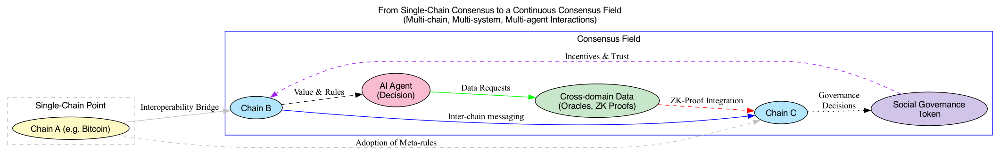
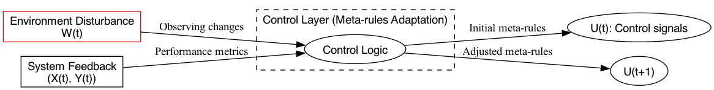

# BitAgere：一个以比特币为底层的多元Agere 互联系统

## 摘要

在无中心权威与多智能体并存的时代，信任与共识的构建已成为核心挑战。本文在图灵可计算性与哥德尔不完备性定理的哲学与数学思考下，引入维纳控制论的反馈机制，提出Cognito理论模型，以“控制—计算—通信”三元闭环结构为基础，构建出自适应且可持续演化的共识逻辑框架。

在实践层面，以Bitcoin的安全性与去中心化为根基，BitAgere系统通过设计“机械契约”连接多个Agent所组成的“Agere”，从而形成可扩展的共识场，实现在全网中高效的信息交互与决策整合。通过这种自适应共识机制，智能体间的信任传递与协同无需中心管理，从而构建出一个安全、可信、高效协同的Agere世界，为解决信息时代日益增长的分布式信任问题提供全新的理论与实践路径。

## 1. 引言

### 1.1 背景与问题提出

信息时代中，数据与参与者不断增加，系统环境高度不确定且动态演化，传统中心化信任机制面临安全与治理上的严峻挑战。比特币以PoW共识在无中心条件下实现账本一致性与可信交易，展现出无第三方中介的点对点电子现金系统的潜力。

然而，对比特币及其他区块链系统的理解多停留在工程实践与博弈论分析，缺乏统一的哲学（逻辑基础）、数学（可计算性与系统局限）与控制论（反馈自适应）视角下的根本性框架。本文试图解答两大问题：

1. 为什么纯粹依靠计算与通信不足以在开放、动态且无中心权威的环境中持续构建可信共识？
2. 如何在此基础上提出一套具有解释力与可扩展性的理论模型，为未来分布式系统的设计与进化指引方向？

### 1.2 研究目标与贡献

本文回溯图灵可计算性理论，借助哥德尔不完备性定理及控制论反馈思想，以建立能统一解释去中心化共识内在逻辑的理论框架。主要贡献包括：

- 从数学与哲学层面揭示纯计算模型在动态环境下的不足，强调元规则调节的重要性。
- 将控制、计算、通信纳入同一理论结构（控制论三元组模型），形成自适应闭环。
- 基于此模型剖析比特币共识本质，并展望构建更高级的跨链共识场“BitAgere”。

## 2. 理论基础与Cognito模型的逻辑建构

在异构且无中心权威的动态环境中实现分布式共识，是当前信息时代面临的根本性挑战。既有理论（如FLP不可能性定理与拜占庭将军问题）显示，在异步网络与潜在恶意节点条件下，严格的确定性一致性难以保证。然而，比特币通过PoW共识与经济激励，事实性地突破了部分苛刻前提，实现了长期稳定与可信的去中心账本。这种稳定性背后的更深层逻辑机制何在？我们需要超越纯工程与博弈分析，从哲学、数学与控制论角度构建新的理论框架。

### 2.1 从可计算性与不完备性到元规则需求

**图灵极限与纯计算模型的适应性困境**：

图灵机理论为可计算函数提供了形式化基础，但前提是输入域和规则集在设计时已固定。当分布式系统环境中节点数量、攻击手段、网络拓扑持续变化时，原有规则的适用性与完备性面临挑战。纯计算模型相当于一个静态映射 *K* : *X* → *Y*（其中 *X*为状态空间，*Y*为输出空间），若环境扰动 *w*(*t*)超出初始设计域，则系统无法通过既定规则生成有效决策，陷入适应性危机。

**哥德尔不完备性定理的启示**：

哥德尔定理指出复杂形式系统内部存在不可决问题，即任何封闭系统无法自我证明其完备性。类比至分布式共识：当出现新的攻击模式或策略组合超出初始协议定义的逻辑“公理系”时，系统在内部框架下无法生成应对方案。此类比并非严格数学推断，但提供了启示：若无额外“元规则层”对协议进行动态扩展与修正，系统将难以应对不可决问题，导致共识机制的适应性不足。

由此可见，为应对环境中不可预测的变化（不可决问题），系统需在内部规则之外增设一层元规则调控结构，以突破纯计算模型的封闭性与静态性。

### 2.2 维纳控制论与反馈闭环的引入

**反馈控制的理念**：

控制论（Wiener, 1948）为在不确定环境中维持系统目标输出提供了基础方法论：通过比较系统当前输出与期望目标，将误差反馈至控制层，进而动态调整系统参数与策略。此反馈回路使系统在扰动下仍可保持稳态或持续演化。

**三元闭环构架**：

参考控制论思想，我们将分布式共识系统抽象为由控制（Control, *C*）、计算（Computation, *K*）与通信（Communication, *M*）三部分构成的闭环结构。定义如下函数映射：

- *C* : *X* × *W* → *U*：控制层从状态 *x*(*t*) 和环境扰动 *w*(*t*)中提取信息，输出元规则指令 *u*(*t*)。这相当于系统的战略层，对共识协议参数（如难度目标、经济激励机制）进行动态调优。
- *K* : *X* × *U* → *Y*：计算层在控制指令 *u*(*t*) 下对状态 *x*(*t*)执行具体验证与记账操作（如交易校验与区块构造），输出结果 *y*(*t*)。
- *M* : *X* × *Y* → *X*：通信层将计算结果 *y*(*t*) 在网络中扩散与整合，使全网节点对下一状态 *x*(*t*+1) 达成一致更新。

通过*C* − *K* − *M*循环迭代，系统状态随时间演化：

$$
x(t) → u(t) → y(t) → x(t+1)
$$

当外部扰动 *w*(*t*) 改变，控制层 *C*可实时调整 *u*(*t*)，进而影响计算与通信过程，使系统在反馈闭环下对新问题做出自适应响应。

### 2.3 控制论三元组模型（Cognito理论）的确立

综合以上分析，我们得出认知上的跃迁：需在纯计算模型之上引入控制层（元规则层）与通信整合，构建具备自适应进化能力的共识框架。这一思想可在数学与逻辑层面形式化为控制论三元组模型（Cognito理论）：

**定义**：

分布式共识系统 *S* 表示为三元组 (*C*,*K*,*M*)，满足：

1. *C* : *X* × *W* → *U* 提供元规则调控能力，对环境扰动进行动态响应。
2. *K* : *X* × *U* → *Y* 在给定策略下执行共识逻辑与计算操作。
3. *M* : *X* × *Y* → *X* 保证信息在全网有效传递与整合，实现状态更新。
   
    
    

通过此模型，我们可分析在不确定条件下系统的稳定性、适应性与扩展性。若进一步借助控制论中的稳定性判定方法（如Lyapunov分析、*H*∞控制或鲁棒控制理论），有望在数学上严格论证系统在一定扰动集下实现稳态或持续演化的条件。

### 2.4 理论意义与后续研究方向

Cognito理论超越了对比特币等单一案例的工程理解，为多智能体共存的无中心系统构建了统一的理论范式。在哲学上，此模型呼应了哥德尔定理对形式体系内部演绎局限的启示；在数学与工程上，通过将控制、计算、通信纳入同一闭环结构，提供了应对不可预测变化的体系化方法；在应用层面，为未来的多链共识生态、跨域互操作与自治组织的设计提供了新思路。

后续章节将以实证研究（如对比特币系统的剖析与扩展）检验Cognito理论的解释力和适用性，并进一步探讨在更复杂的共识场景下，如何运用该模型指导机制设计与协议演化，从而为分布式信任问题提供系统性解决方案。

## 3. 比特币共识的三元组解构

在前文构建的控制论三元组模型 (C, K, M) 及自适应共识框架下，本节以比特币为经典实例，系统地阐释其从链级共识到资产层与用户层的延伸与传导机制。通过剖析UTXO模型与SPV轻验证方案，我们展示共识如何在多层次结构中实现价值与可信性的传导。进一步，我们将这种多维扩展外推至更高层次的“共识场”设想，使分布式信任能在多主体、多系统中连续流动，最终形成超越单链、跨域协同的全球共识生态（BitAgere）。

### 3.1 比特币共识的C-K-M闭环诠释

比特币的PoW共识机制为C-K-M三元组模型提供了经典实践原型：

- **控制层 (C)**：通过动态调整挖矿难度与减半奖励等元参数来应对外部扰动（算力变化、参与者策略转移），确保系统长期稳定与安全。这一控制信号 $u(t)$不断反映系统所处环境与目标的变化，使共识协议具备自适应能力。
- **计算层 (K)**：矿工执行哈希计算验证候选区块，节点对交易与区块进行逻辑校验与脚本验证。这将抽象的控制策略转化为可检查的具体产出 $y(t)$，确保账本更新的正确性。
- **通信层 (M)**：P2P网络使新区块、交易验证结果在全网扩散与整合，节点更新全局状态 $x(t+1)$。在无中心条件下，这一信息传播保证全网对链状态的高度同步与一致性。

在比特币中，这一C-K-M循环使系统在外部扰动下保持有序进化：控制层自适应调控、计算层严格执行、通信层达成无中心共识。其结果是形成一种“自适应机械共识”，即共识既机械严格，又能通过元规则迭代适应环境变化。

### 3.2 UTXO与共识资产化：从链级共识到价值单元背书

比特币的创新不止于维持全局账本一致性，更在于其通过UTXO模型将共识内嵌为经济意义清晰的价值单元：

- 当节点对包含特定交易的区块达成共识，该交易派生的UTXO即获得全网确认的经济属性。
- 共识不再仅是抽象的链状态记录，也成为可被用户自由流转、保有和验证的“共识资产”。
- 控制与计算层确保UTXO的合法性与稀缺性，通信层确保这一资产状态在全网无缝同步。UTXO模型将共识固化为可传递的价值，使共识成果具备经济激励与配置效能。

由此，共识实现“资产化”：链级规则衍生出具备普遍公信力的数字价值单元，为经济活动与信用传递提供底层保障。

### 3.3 SPV机制与共识传导：从全节点到轻客户端的可信缩放

SPV（Simplified Payment Verification）使轻量客户端无需储存完整链数据，即可验证特定交易的合法性与共识安全性。这是共识在用户层面的缩放与传导过程：

- **控制层 (C)** 所实现的难度调节（PoW）在区块头中保留硬性验证标记，为SPV提供全局安全度量基础。
- **计算层 (K)** 所做的全部验证与执行结果被全节点固化于区块链中，SPV客户端无需重复计算，而只需获取与目标交易相关的区块头与Merkle证明。
- **通信层 (M)** 将区块头链及相应的Merkle路径传输给SPV客户端，使其在低数据成本下继承全网共识的安全背书。

SPV体现了共识的分层传导与效率提升：全节点构筑全局共识基础，轻节点以最小数据开销获得安全性与可信性，从而实现用户侧的低信任成本接入。这使共识得以在用户端自然延伸，增强系统的包容性与实际使用价值。

### 3.4 共识跨域扩展与BitAgere构想：从多链互操作到共识场

当前的共识生态仍是离散且分割的：不同链、不同应用场景、不同共识机制常以孤立状态并存，缺乏持续而自然的信任传导机制。BitAgere的提出旨在将这种离散性转化为连续的“共识场”（Consensus Field）：

- **从点到场**：将单链共识视为一个点，共识场则是将多链、多系统、多主体的共识映射至连续的拓扑结构。
- **C-K-M拓展**：在共识场中，控制层不再局限于单系数调整，而是对多维主体（人类社会、其他区块链、AI Agent）的规则进行元层规划；计算层整合多源验证逻辑（跨链消息认证、零知识证明、AI决策映射）；通信层扩展至跨域路由、跨系统中继协议，使信息与信用在全局范围内以连续场的方式流动。
- **共识资产化的进一步升华**：在共识场中，资产不止于UTXO式的单链价值单元，还包括跨链信用凭证、社会治理代币、AI模型参数化激励等多层次价值抽象。共识资产成为共识场中传递信任的载体，使人类、机器、合约、Agent之间的信任实现多向度、连续化的互动。

通过共识场的设想，BitAgere 不仅是多链互操作的技术实现，更是一个逻辑与哲学范式上的升维：共识不再是单点孤立共识的叠加，而是以连续结构提供全局性的信任传导，从而有望降低摩擦、提高资源配置效率，为全球多主体协同创造条件。

### 3.5 小结

在本节中，我们从比特币系统的C-K-M闭环解构出发，解析了其共识自适应性与多层次传导属性。通过UTXO模型，共识被固化为具经济价值的资产单元；借助SPV机制，共识得以精简、扩散至轻客户端用户层面。进一步的逻辑外推导致我们构想了BitAgere及共识场理论，以期在多链、多主体环境中实现连续而高效的共识与信任传导。

这标志着从局限于单系统的去中心化共识向全局性、连续化的多维信任结构的跃迁。C-K-M模型为此宏大愿景奠定理论基础，而共识场提供了统一视角，将不同类型的共识机制、资产化过程与自适应控制策略整合于一条可持续演化的逻辑主线。

## 4. BitAgere 多智能体共识体系

在中本聪共识（PoW）奠定的安全基石与Cognito理论的启示下，BitAgere尝试将多智能体（Agents）的策略决策、价值传递与信誉进化统一于一个无中心的共识场（Consensus Field）。通过“机械共识”与“机械契约”范式（Agere构想）整合控制（C）、计算（K）、通信（M）三元闭环结构，BitAgere将多智能体协同从离散决策提升至可持续演化的”机械世界”框架中，从而实现共识的资产化、算力化与多链扩展。

### 4.1 分层架构与Agent互联

BitAgere采用分层化结构，将BTC主链作为全球安全锚定点（共享BTC共识安全），在此基础上搭建侧链（BEVM）与链下虚拟机集群，为多智能体间的交互与优化提供可编程环境与高维计算能力。各层间的输入/输出（I/O）映射、策略变换与状态锚定形成闭环：

- **C1层（BTC安全锚定层）**：
  
    通过中本聪共识与可信锚定，使全球状态承诺具有公认基准。这里的机械共识与Cognito元规则调节（Control）共同为上层Agent交互提供坚实可信点。
    
- **C2层（BEVM可编程执行与双PoS模型层）**：
  
    扩展BTC共识安全基石，以BEVM侧链实现智能合约执行与策略参数更新。利用双PoS概率模型，实现共识扩展、价值流动与策略合约（机械契约）的灵活部署。
    
- **C3层（链下VM集群与BFT共识优化层）**：
  
    在该层，Agents的多维策略（BDI心智模型、AOP范式）通过链下虚拟机集群进行异步优化与信誉张量评估。BFT共识确保在异质、多模态数据与不确定环境下仍可收敛至稳健解。此处的Agentification赋予节点对策略、信誉与收益的持续演化能力。
    
- **C4层（多智能体交互层）**：
  
    最外层大量Agents（Agent0等具备基础心智态框架的智能体）通过提交策略、领取激励并相互评估的方式不断适应环境变化，实现从个体决策到全网协同的涌现（Emergence）。这使共识不再局限于单链账本的一致，而成为多Agent在共识场中持续分工、互信与进化的动态过程。
    

### 4.2 Agent模型与内部心智态BDI结构

每个Agent具备明确的Agenthood，通过内嵌BDI（信念-Belief、愿望-Desire、意图-Intention）模型与AOP思想，将Cognito三元闭环逻辑映射为智能体的内部策略机理：

- **Belief（信念）**：
  
    来自C1、C2、C3层的锚定状态与信誉分布构成Agent的基础信念输入。Agent对全网状态、BTC共识安全、计算贡献与他人产出质量的判断由此建立。
    
- **Desire（愿望）**：
  
    Agent依据通胀奖励、Bonds回报、共识算力化指标以及对特定应用领域（文本处理、图像识别）的适应需求，形成目标偏好。
    
- **Intention（意图）**：
  
    在控制层元规则调优、链下优化决策包（C3层）和侧链智能合约机制（C2层）共同作用下，Agent将自己的计算资源、验证能力、激励布局（Stake与Bonds）映射为具体决策，体现出自适应与持续进化的意图输出。
    

这一过程彰显Agentification：原本被动参与共识的节点，转化为在机械世界中主动规划策略、评审他人行为、投资互信关系的智慧主体。

### 4.3 Emergence与自适应：多Agent协作的机械世界

由于各Agent在多层结构与多模态数据间交互，系统的整体行为呈现涌现特征。Agents基于机械契约（合约代码的形式化约束）、共识资产化（UTXO或跨链价值单元）、算力化（将智能算力贡献映射为经济价值）与声誉传导（Agere框架下的信誉传输）不断自组织。通过Input/Output映射与控制论反馈，个体的微观调整在宏观层面形成多智能体共识场，类似于机械世界中的持续自适应生态。

在这一共识场中，Agents不但解决中本聪问题（在无中心条件下保持长期稳定性），还进一步在异构环境下，通过策略演化与BFT共识对不可预测扰动进行稳健回应。此过程中：

- 高信誉Agent获得更多Stake支持，进而提升在后续策略优化中的决策影响力。
- 异质Agent擅长不同领域任务，使共识从简单账本验证扩展到高维智能应用领域。
- 随着环境变化与性能指标更新，Agents通过分布式强化学习、进化算法或其他智能优化手段不断更新策略，使全网逐步逼近多目标纳什均衡的动态轨道。

BitAgere的设计不仅传承了比特币无中心、可信账本的核心特质，更强调在多主体、多层次、多领域下持续适应与进化的全新共识生态。

## 5. 实践挑战与改进路径：从链上计算瓶颈到分布式智能演化

在BitAgere的多智能体共识体系中，大量Agent需对高维度数据（如信誉矩阵、策略张量）进行复杂求解和概率收敛计算，以实现动态适应与策略优化。然而，将此类高强度计算直接集中于链上执行不仅面临安全与可扩展性瓶颈，还会导致对真实场景的模拟与逼近陷入悖论。为克服这些难题，本节在深入分析问题根源的基础上，提出一套基于分布式算力扩展与链上轻量验证的改进路径与设计原则，为多智能体共识生态的持续演化提供可操作的技术方案。

### 5.1 链上计算瓶颈与多Agent求解难题

在传统区块链架构下，链上资源（计算、存储、带宽）均需高度受控，以确保系统安全性与去中心化特性。这使得在链上直接求解高维矩阵、复杂博弈优化或概率收敛计算变得困难重重：

- **资源受限**：
  
    链上执行环境对计算与内存严格限制，若尝试在此基础上逼近真实生态下的复杂策略空间，将严重牺牲吞吐效率与用户体验。
    
- **抽样与近似不足**：
  
    链上节点数量与处理能力有限，难以为多Agent策略评估提供充足的样本与多源数据支持。策略优化若仅依赖少量链上节点的计算与评分，极易导致结果失真。
    
- **精确求真与真实逼近的悖论**：
  
    若在链上寻求全局最优解，必须简化模型或缩小参与范围，势必偏离真实商业与多主体互动的复杂性；若保留高度复杂度，则链上计算无法承受，陷入进退两难。
    

这些限制说明，仅靠链上集中计算难以满足BitAgere体系中对多Agent智能演化的高维度与高灵活性要求。

### 5.2 改进思路：分布式算力扩展与链上轻量验证

借鉴Bitcoin等分布式系统的成功经验，我们可以将高强度计算任务下放至链下Agent并行处理，通过海量并行实现近乎无限的计算资源扩张，而链上则聚焦轻量化验证与元规则调优，从而在无中心条件下确保最终状态的可信性与收敛特性。

1. **分布式算力下放**：
   
    将大规模策略优化、信誉矩阵求解与概率迭代计算等高强度任务交由无数Agent在链下独立执行。各Agent在本地并行处理数据与求解模型，使系统能灵活吸纳外部算力资源，而无需在链上承载额外负荷。
    
2. **链上轻量验证与统计抽样**：
   
    链上智能合约并非直接参与全局求解，而是通过随机抽样、哈希校验、Merkle证明与统计过滤等轻量化手段，对Agent提交的结果进行审查与验证。若发现结果偏差或异常，可通过控制层（C层）的元规则动态调整验证频率与激励参数，以形成自适应的闭环控制机制。
    
3. **宏观涌现优先于微观求真**：
   
    链上的角色更像一位观察者与仲裁者，不需也不可能对每个细节进行全局求真。通过大量Agent在链下的博弈与探索，系统不断逼近真实生态下的复杂状态；链上则通过轻量证据与基本约束，维持共识可信度与全局演化方向。
    

### 5.3 基于Cognito三元闭环的自适应架构

将上述思路映射回Cognito理论模型的C-K-M闭环结构与Agent内部BDI心智态框架，可进一步强化自适应特性：

- **控制层（C）**：
  
    设置链上验证与抽样策略，动态调节激励分配与参数阈值。当环境变化或数据偏差出现时，控制层通过微调元规则，引导系统回归稳健状态。
    
- **计算层（K）**：
  
    在链下由多Agent执行高强度计算与策略优化。各Agent根据自身信念（Belief）与期望（Desire），利用本地算力迭代求解并逼近最优策略，并在链上提交结果哈希或证明。
    
- **通信层（M）**：
  
    在无中心网络中扩散与整合Agent的计算结果及链上反馈信号，确保全网信息传递与状态共享顺畅无碍。
    

这一架构使系统在宏观上呈现涌现特征：大规模分布式并行计算（链下）与轻量验证（链上）共同塑造出可适应异质环境、支持多场景扩展的多Agent共识生态。

### 5.4 未来展望与持续演化

通过分布式算力扩展与链上轻量验证的协同方案，BitAgere有望在实践中实现理论所构想的分布式智能演化图景。随着Agent数量与多样性的增加，系统的计算能力与策略空间将呈指数级扩张。链上作为元规则调控与可信承诺的中枢，只需对提交结果进行轻量审查与抽样控制，即可维持全局共识的可信性与收敛方向，从而在面对外部不确定性时达到更高层次的稳健性与适应性。

这一演化路径为多主体无中心协作开辟了全新方向：在不依赖中心权威的前提下，以分布式智能算力与轻量化链上验证为基础，不断吸纳新任务、新数据源与新策略优化方法，使共识场在真实复杂生态中持续进化，为未来跨链、多域、多智能体协同治理奠定基础。

## 6. 结语

本文在比特币无中心共识的启示下，通过引入图灵可计算性理论、哥德尔不完备性定理的哲学与数学启示及维纳控制论的反馈思想，提出了Cognito理论模型，将控制（C）、计算（K）、通信（M）三元闭环结构融入分布式共识设计当中。在该模型下，我们不仅分析了比特币的共识机制及其自适应逻辑，还构想了多智能体协同进化的BitAgere体系，为未来的跨链、多主体协作和智能场景扩展提供理论与实践方向。

通过对多Agent策略计算下放至链下、链上轻量化验证与抽样控制的分层设计，本文提出了一条从纯计算、纯博弈模型向自适应、可扩展的分布式智能演化路径。由此，去中心化系统不再受限于固定规则与封闭逻辑，而能在动态环境中持续进化、适应与优化。

展望未来，当多智能体在无中心共识场中以分布式智能协同的方式不断演化，这一模式有望在更广泛的领域（跨链互操作、自治组织管理、智能经济协作）中发挥作用。Cognito理论与BitAgere架构为应对信息时代快速增长的分布式信任需求提供了新的范式，为全球化、跨领域、多主体间的协同治理奠定了坚实的哲学、数学与工程基础。

## 7. 参考文献

1. Turing, A. M. (1936). "On Computable Numbers, with an Application to the Entscheidungsproblem." *Proceedings of the London Mathematical Society*, 2(42):230–265.
2. Gödel, K. (1931). "Über formal unentscheidbare Sätze der Principia Mathematica und verwandter Systeme I." *Monatshefte für Mathematik und Physik*, 38:173–198.
3. Wiener, N. (1948). *Cybernetics: Or Control and Communication in the Animal and the Machine.* MIT Press.
4. Fischer, M. J., Lynch, N. A., & Paterson, M. S. (1985). "Impossibility of distributed consensus with one faulty process." *Journal of the ACM (JACM)*, 32(2):374–382.
5. Lamport, L., Shostak, R., & Pease, M. (1982). "The Byzantine generals problem." *ACM Transactions on Programming Languages and Systems (TOPLAS)*, 4(3):382–401.
6. Nakamoto, S. (2008). "Bitcoin: A Peer-to-Peer Electronic Cash System." https://bitcoin.org/bitcoin.pdf
7. Shoham, Y. (1993). "Agent-oriented programming." *Artificial Intelligence*, 60(1):51–92.
8. Rao, A. S. & Georgeff, M. P. (1995). "BDI agents: from theory to practice." In *Proceedings of the First International Conference on Multi-Agent Systems (ICMAS-95)*, pp. 312–319.
9. Wooldridge, M. (2002). *An Introduction to MultiAgent Systems.* Wiley.
10. Weiss, G. (Ed.). (1999). *Multiagent Systems: A Modern Approach to Distributed Artificial Intelligence.* MIT Press.
11. Stone, P. & Veloso, M. (2000). "Multiagent systems: A survey from A machine learning perspective." *Autonomous Robots*, 8(3):345–383.
12. Wooldridge, M., Jennings, N. R., & Kinny, D. (2000). "The Gaia Methodology for Agent-Oriented Analysis and Design." *Autonomous Agents and Multi-Agent Systems*, 3(3):285–312.
13. Belchior, R., Vasconcelos, A., Correia, M., & Vieira, M. (2021). "A Survey on Blockchain Interoperability: Past, Present, and Future Trends." *ACM Computing Surveys (CSUR)*, 54(8):1–41.