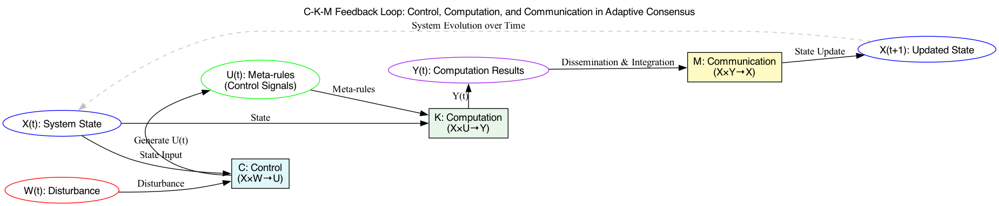

# BitAgere - A Multi-Agere Interconnected System

## Introduction

A next-generation, multi-dimensional consensus framework built upon Bitcoin’s secure and decentralized foundations. BitAgere leverages the “Control–Computation–Communication” (Cognito) model to achieve adaptive, evolving consensus beyond traditional blockchain paradigms.

## White Paper

For an in-depth understanding of the BitAgere system, please refer to our white papers available in both Chinese and English:

- [BitAgere White Paper (Chinese)](BitAgere_一个以比特币为底层的多元Agere互联系统.md)
- [BitAgere White Paper (English)](BitAgere_A_Multi-Agere_Interconnected_System_Based_on_Bitcoin.md)

These documents offer detailed insights into the system architecture, design principles, and implementation strategies.

## Contributing

Contributions are welcome! Please open an issue or submit a pull request with suggestions or improvements.

## License

This project is licensed under the MIT License - see the [LICENSE](LICENSE) file for details.
